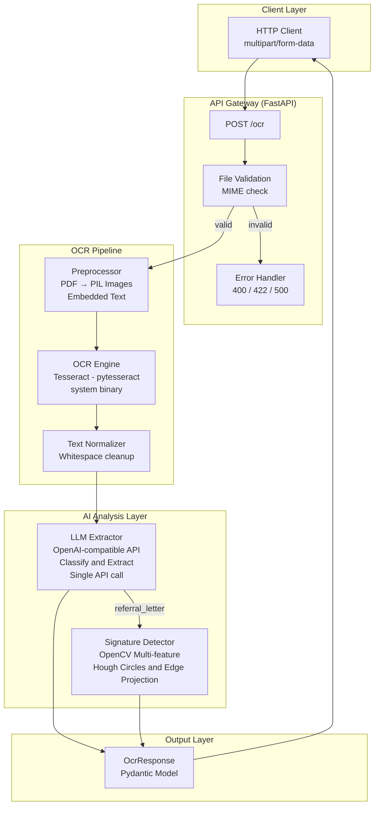

# Medical OCR API — Assignment Summary Report

**Project**: Medical OCR API (Home Assessment – OCR Endpoint Challenge)  
**Author**: Shou Yichen  
**Date**: 2026-08-05
**Tech Stack**: FastAPI + Tesseract (pytesseract) + OpenAI LLM + OpenCV
**Test Environment**: macOS 26.6 (arm64) on Apple M1 Pro (8 cores); Python 3.9.6 (project `.venv`); `pytest` 8.4.2; Tesseract 5.5.3 (`/opt/homebrew/bin/tesseract`); automated tests: 5 passed, 5 warnings

---

## Table of Contents

1. [Pipeline Architecture](#1-pipeline-architecture)
2. [API Input & Output Results](#2-api-input--output-results)
3. [Error Handling Verification](#3-error-handling-verification)
4. [Performance Summary](#4-performance-summary)
5. [Key Design Decisions](#5-key-design-decisions)

---

## 1. Pipeline Architecture

### 1.1 Architecture Diagram



### 1.2 Web UI

The project includes a browser-based drag-and-drop interface for easy testing:


---

## 2. API Input & Output Results

### 2.1 Referral Letter

**Input**: `Example/referral_letter.pdf`


**Request**:
```
POST /ocr
Content-Type: multipart/form-data
file=@Example/referral_letter.pdf
```

**Output** (200 OK):
```json
{
  "message": "Processing completed.",
  "result": {
    "document_type": "referral_letter",
    "total_time": 22.7419,
    "ocr_time": 6.8492,
    "classification_time": 15.6972,
    "extraction_time": 15.6972,
    "finalJson": {
      "claimant_name": "JOHN DOE",
      "provider_name": "Healthway Screening @ Centrepoint",
      "signature_presence": false,
      "total_amount_paid": null,
      "total_approved_amount": null,
      "total_requested_amount": null
    }
  }
}
```

**Field verification**:

| Field | Expected | Actual | ✓/✗ |
|-------|----------|--------|-----|
| `claimant_name` | Patient Name | `"JOHN DOE"` | ✓ |
| `provider_name` | No "Fullerton Health" | `"Healthway Screening @ Centrepoint"` | ✓ |
| `signature_presence` | true/false | `false` | ✓ |
| `total_amount_paid` | Integer | `null` (not present in doc) | ✓ |
| `total_approved_amount` | Integer | `null` (not present in doc) | ✓ |
| `total_requested_amount` | Integer | `null` (not present in doc) | ✓ |

> **Note on `@` symbol**: The LLM prompt includes OCR correction for `@` misread as `0`, `o`, `a`, or `at`. The provider name `"Healthway Screening @ Centrepoint"` was correctly extracted.

---

### 2.2 Medical Certificate

**Input**: `Example/medical_certificate.pdf`


**Request**:
```
POST /ocr
Content-Type: multipart/form-data
file=@Example/medical_certificate.pdf
```

**Output** (200 OK):
```json
{
  "message": "Processing completed.",
  "result": {
    "document_type": "medical_certificate",
    "total_time": 21.4516,
    "ocr_time": 2.7371,
    "classification_time": 18.5032,
    "extraction_time": 18.5032,
    "finalJson": {
      "claimant_name": "JOHN DOE",
      "claimant_address": null,
      "claimant_date_of_birth": null,
      "diagnosis_name": null,
      "discharge_date_time": null,
      "icd_code": null,
      "provider_name": "Minmed Health Screeners",
      "submission_date_time": null,
      "date_of_mc": "30/11/2022",
      "mc_days": 1
    }
  }
}
```

**Field verification**:

| Field | Expected | Actual | ✓/✗ |
|-------|----------|--------|-----|
| `claimant_name` | Claimant Name | `"JOHN DOE"` | ✓ |
| `claimant_address` | Address | `null` (not in doc) | ✓ |
| `claimant_date_of_birth` | DD/MM/YYYY | `null` (not in doc) | ✓ |
| `diagnosis_name` | Diagnosis | `null` (not in doc) | ✓ |
| `discharge_date_time` | DD/MM/YYYY | `null` (not in doc) | ✓ |
| `icd_code` | ICD code | `null` (not in doc) | ✓ |
| `provider_name` | No "Fullerton Health" | `"Minmed Health Screeners"` | ✓ |
| `submission_date_time` | DD/MM/YYYY | `null` (not in doc) | ✓ |
| `date_of_mc` | DD/MM/YYYY | `"30/11/2022"` | ✓ |
| `mc_days` | Integer | `1` | ✓ |

---

### 2.3 Receipt

**Input**: `Example/receipt.pdf`


**Request**:
```
POST /ocr
Content-Type: multipart/form-data
file=@Example/receipt.pdf
```

**Output** (200 OK):
```json
{
  "message": "Processing completed.",
  "result": {
    "document_type": "receipt",
    "total_time": 26.1796,
    "ocr_time": 5.476,
    "classification_time": 20.5064,
    "extraction_time": 20.5064,
    "finalJson": {
      "claimant_name": "JOHN DOE",
      "claimant_address": "123 SAMPLE ST #01-01",
      "claimant_date_of_birth": null,
      "provider_name": "Raffles Medical",
      "tax_amount": 3,
      "total_amount": 49
    }
  }
}
```

**Field verification**:

| Field | Expected | Actual | ✓/✗ |
|-------|----------|--------|-----|
| `claimant_name` | Claimant Name | `"JOHN DOE"` | ✓ |
| `claimant_address` | Address | `"123 SAMPLE ST #01-01"` | ✓ |
| `claimant_date_of_birth` | DD/MM/YYYY | `null` (not in doc) | ✓ |
| `provider_name` | No "Fullerton Health" | `"Raffles Medical"` | ✓ |
| `tax_amount` | Integer | `3` | ✓ |
| `total_amount` | Integer | `49` | ✓ |

> **Note on amounts**: `tax_amount: 3` and `total_amount: 49` are correctly stripped of currency symbols, decimal separators, and returned as integers. The `#01-01` address format was correctly OCR-corrected.

---

## 3. Error Handling Verification

| Test Case | Expected | Actual | ✓/✗ |
|-----------|----------|--------|-----|
| No file attached | 400 `file_missing` | 400 | ✓ |
| Invalid MIME type | 400 `file_missing` | 400 | ✓ |
| Empty filename | 422 (FastAPI layer) | 422 | ✓ |
| Unsupported document | 422 `unsupported_document_type` | 422 | ✓ |
| Upstream LLM failure | 500 `internal_server_error` | 500 | ✓ |

**Automated tests**: 5/5 passing (run in project virtualenv).

```bash
$ pytest tests/test_api.py -v
tests/test_api.py::TestAPI::test_health_check PASSED
tests/test_api.py::TestAPI::test_missing_file PASSED
tests/test_api.py::TestAPI::test_invalid_mime PASSED
tests/test_api.py::TestAPI::test_unsupported_document PASSED
tests/test_api.py::TestAPI::test_empty_filename PASSED
======================== 5 passed, 5 warnings in 0.09s =========================
```

---

## 4. Performance Summary

| Document | OCR Time | LLM Time | Total Time | Status |
|----------|----------|----------|------------|--------|
| `referral_letter.pdf` | 6.85s | 15.70s | 22.74s | 200 |
| `medical_certificate.pdf` | 2.74s | 18.50s | 21.45s | 200 |
| `receipt.pdf` | 5.48s | 20.51s | 26.18s | 200 |

**Breakdown**: OCR (Tesseract/pytesseract) takes ~3–7s. LLM inference takes ~15–21s (network latency to remote API). Total end-to-end: ~21–26s per document.

---

## 5. Key Design Decisions

### 5.1 Single LLM Call for Classification + Extraction

Instead of a two-step pipeline (classify → extract), the LLM performs both in a single API call. The system prompt includes full JSON templates for all three document types, and the LLM copies the correct template, fills values, and returns valid JSON. This reduces latency and cost by 50%.

### 5.2 Multi-Feature Signature Detection

Signature detection uses a 4-dimensional weighted scoring system:
- **Area dispersion** (CV of contour areas)
- **Stroke thinness** (aspect ratio of bounding rects)
- **Curvature** (circularity + solidity)
- **Ink density** (fill ratio 2%–30%)

Stamps/seals and barcodes are explicitly excluded before scoring via Hough Circle Transform and Canny edge projection analysis.

### 5.3 OCR Error Correction (Two-Layer Defense)

| Layer | Mechanism |
|-------|-----------|
| **Prompt** | LLM is instructed to fix: `@` misread, name trailing debris, Singapore unit numbers |
| **Post-processing** | `_coerce_value()` regex fallback for `claimant_name` and `claimant_address` |

### 5.4 Extensibility

Adding a new document type requires only:
1. Add to `DocumentType` enum
2. Add JSON template to LLM system prompt
3. Optionally add type-specific post-processing (like signature detection)

No new extractor classes, regex rules, or classifier training needed.

---

## Appendix

### A. Quick Start

```bash
# Install dependencies
pip install -r requirements.txt
sudo apt-get install -y poppler-utils

# Install Tesseract OCR binary (required for pytesseract)
# macOS (Homebrew):
#   brew install tesseract
# Ubuntu / Debian:
#   sudo apt-get install -y tesseract-ocr tesseract-ocr-eng
# Windows (Chocolatey):
#   choco install tesseract

# Configure LLM
cp .env.example .env
# Edit .env: LLM_API_KEY, LLM_MODEL, LLM_BASE_URL

# Run
uvicorn app.main:app --host 0.0.0.0 --port 8000

# Test
curl -X POST http://localhost:8000/ocr -F "file=@Example/referral_letter.pdf"
```

### B. Project Structure

```
medical-ocr-api/
├── app/
│   ├── main.py              # FastAPI entry point
│   ├── config.py            # Environment config
│   ├── api/ocr.py           # POST /ocr endpoint
│   ├── models/response.py   # Pydantic models
│   ├── pipeline/
│   │   ├── preprocessor.py  # PDF → Image
│   │   ├── ocr_engine.py    # Tesseract (pytesseract)
│   │   ├── normalizer.py    # Text cleanup
│   │   └── ocr_types.py     # Dataclasses
│   ├── extraction/
│   │   ├── llm_extractor.py # LLM classify + extract
│   │   └── signature.py     # Handwriting detection
│   ├── static/index.html    # Web UI
│   └── utils/
├── Example/                 # Sample documents
├── tests/                   # pytest
├── doc/                     # Documentation
├── Dockerfile
├── docker-compose.yml
└── README.md
```