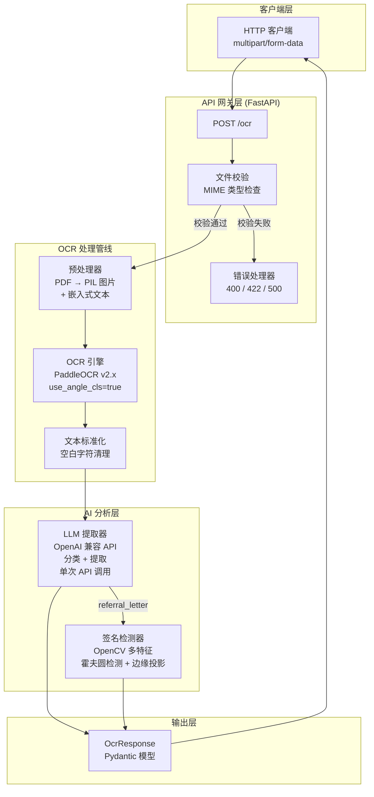
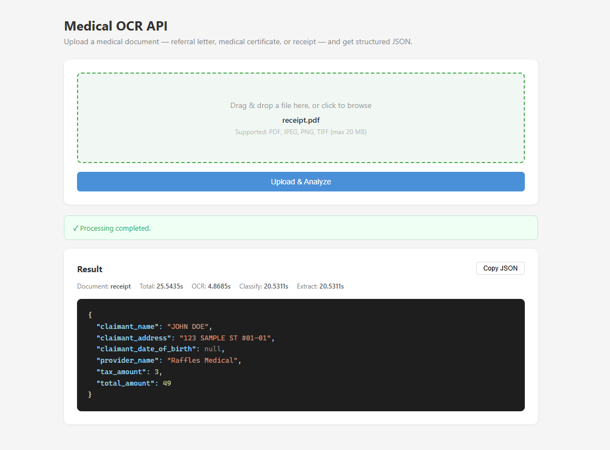
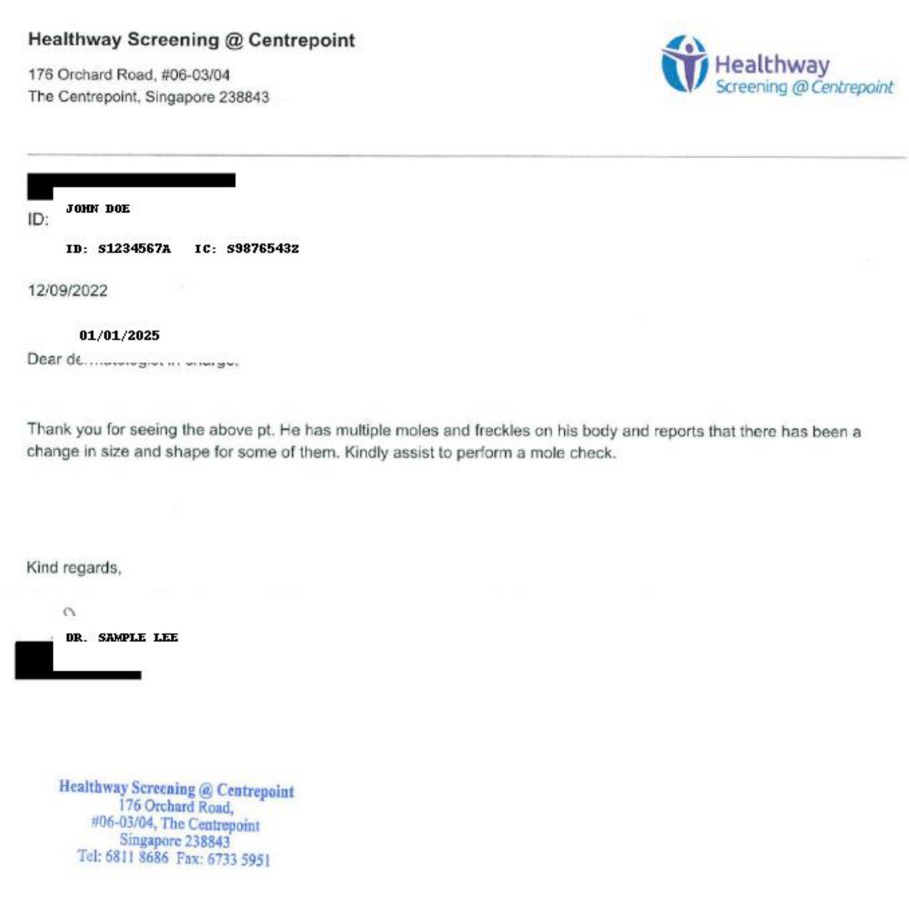
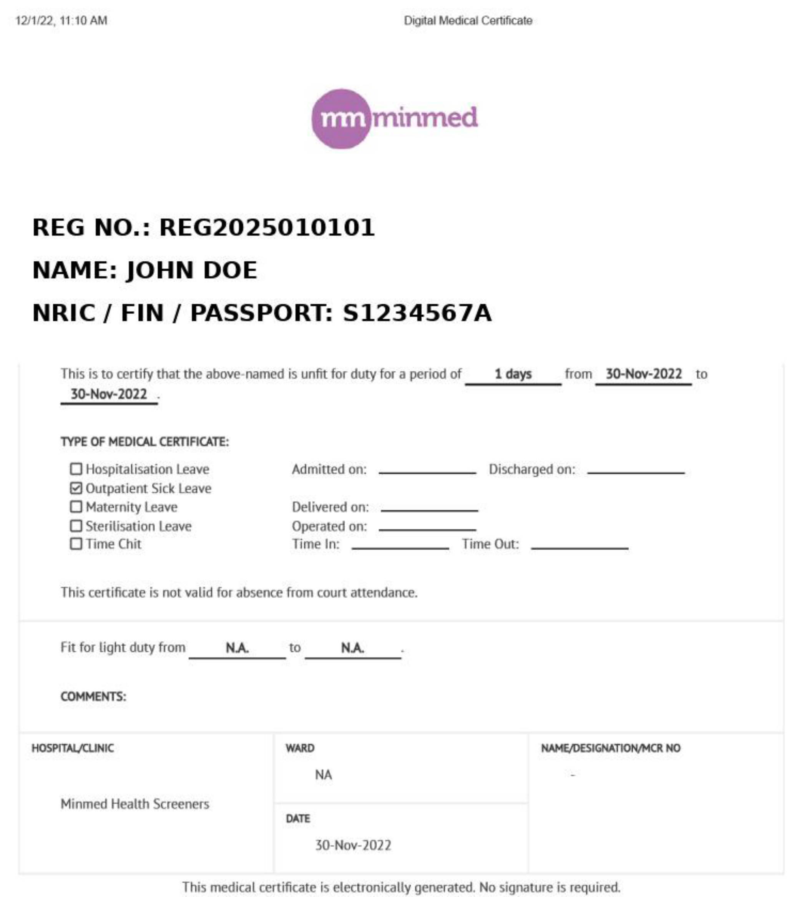
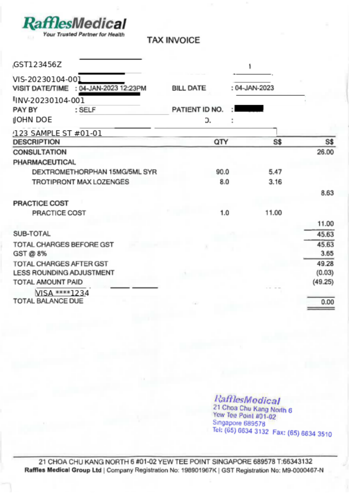

# Medical OCR API — 作业总结报告

**项目**: Medical OCR API（家庭评估 – OCR 端点挑战）  
**作者**: Shou Yichen  
**日期**: 2026-08-04  
**技术栈**: FastAPI + PaddleOCR + OpenAI LLM + OpenCV  
**测试环境**: Intel(R) Core(TM) i7-8700 CPU @ 3.20GHz, Ubuntu 22.04, 32GB RAM, 无独立显卡

---

## 目录

1. [流水线架构](#1-流水线架构)
2. [API 输入输出结果](#2-api-输入输出结果)
3. [错误处理验证](#3-错误处理验证)
4. [性能总结](#4-性能总结)
5. [关键设计决策](#5-关键设计决策)

---

## 1. 流水线架构

### 1.1 架构图



### 1.2 Web 界面

项目内置了基于浏览器的拖拽式上传界面，方便快速测试：



---

## 2. API 输入输出结果

### 2.1 转诊信

**输入**: `Example/referral_letter.pdf`


**请求**:
```
POST /ocr
Content-Type: multipart/form-data
file=@Example/referral_letter.pdf
```

**输出** (200 OK):
```json
{
  "message": "Processing completed.",
  "result": {
    "document_type": "referral_letter",
    "total_time": 22.7419,
    "ocr_time": 6.8492,
    "classification_time": 15.6972,
    "extraction_time": 15.6972,
    "finalJson": {
      "claimant_name": "JOHN DOE",
      "provider_name": "Healthway Screening @ Centrepoint",
      "signature_presence": false,
      "total_amount_paid": null,
      "total_approved_amount": null,
      "total_requested_amount": null
    }
  }
}
```

**字段验证**:

| 字段 | 预期 | 实际 | ✓/✗ |
|-------|----------|--------|-----|
| `claimant_name` | 患者姓名 | `"JOHN DOE"` | ✓ |
| `provider_name` | 不含 "Fullerton Health" | `"Healthway Screening @ Centrepoint"` | ✓ |
| `signature_presence` | true/false | `false` | ✓ |
| `total_amount_paid` | 整数 | `null`（文档中无此信息） | ✓ |
| `total_approved_amount` | 整数 | `null`（文档中无此信息） | ✓ |
| `total_requested_amount` | 整数 | `null`（文档中无此信息） | ✓ |

> **关于 `@` 符号**: LLM 提示词中包含了 OCR 对 `@` 符号的纠错规则（OCR 常误识别为 `0`、`o`、`a` 或 `at`）。供应商名称 `"Healthway Screening @ Centrepoint"` 被正确提取。

---

### 2.2 医疗证明

**输入**: `Example/medical_certificate.pdf`


**请求**:
```
POST /ocr
Content-Type: multipart/form-data
file=@Example/medical_certificate.pdf
```

**输出** (200 OK):
```json
{
  "message": "Processing completed.",
  "result": {
    "document_type": "medical_certificate",
    "total_time": 21.4516,
    "ocr_time": 2.7371,
    "classification_time": 18.5032,
    "extraction_time": 18.5032,
    "finalJson": {
      "claimant_name": "JOHN DOE",
      "claimant_address": null,
      "claimant_date_of_birth": null,
      "diagnosis_name": null,
      "discharge_date_time": null,
      "icd_code": null,
      "provider_name": "Minmed Health Screeners",
      "submission_date_time": null,
      "date_of_mc": "30/11/2022",
      "mc_days": 1
    }
  }
}
```

**字段验证**:

| 字段 | 预期 | 实际 | ✓/✗ |
|-------|----------|--------|-----|
| `claimant_name` | 申请人姓名 | `"JOHN DOE"` | ✓ |
| `claimant_address` | 地址 | `null`（文档中无此信息） | ✓ |
| `claimant_date_of_birth` | DD/MM/YYYY | `null`（文档中无此信息） | ✓ |
| `diagnosis_name` | 诊断 | `null`（文档中无此信息） | ✓ |
| `discharge_date_time` | DD/MM/YYYY | `null`（文档中无此信息） | ✓ |
| `icd_code` | ICD 编码 | `null`（文档中无此信息） | ✓ |
| `provider_name` | 不含 "Fullerton Health" | `"Minmed Health Screeners"` | ✓ |
| `submission_date_time` | DD/MM/YYYY | `null`（文档中无此信息） | ✓ |
| `date_of_mc` | DD/MM/YYYY | `"30/11/2022"` | ✓ |
| `mc_days` | 整数 | `1` | ✓ |

---

### 2.3 收据

**输入**: `Example/receipt.pdf`


**请求**:
```
POST /ocr
Content-Type: multipart/form-data
file=@Example/receipt.pdf
```

**输出** (200 OK):
```json
{
  "message": "Processing completed.",
  "result": {
    "document_type": "receipt",
    "total_time": 26.1796,
    "ocr_time": 5.476,
    "classification_time": 20.5064,
    "extraction_time": 20.5064,
    "finalJson": {
      "claimant_name": "JOHN DOE",
      "claimant_address": "123 SAMPLE ST #01-01",
      "claimant_date_of_birth": null,
      "provider_name": "Raffles Medical",
      "tax_amount": 3,
      "total_amount": 49
    }
  }
}
```

**字段验证**:

| 字段 | 预期 | 实际 | ✓/✗ |
|-------|----------|--------|-----|
| `claimant_name` | 申请人姓名 | `"JOHN DOE"` | ✓ |
| `claimant_address` | 地址 | `"123 SAMPLE ST #01-01"` | ✓ |
| `claimant_date_of_birth` | DD/MM/YYYY | `null`（文档中无此信息） | ✓ |
| `provider_name` | 不含 "Fullerton Health" | `"Raffles Medical"` | ✓ |
| `tax_amount` | 整数 | `3` | ✓ |
| `total_amount` | 整数 | `49` | ✓ |

> **关于金额**: `tax_amount: 3` 和 `total_amount: 49` 已正确去除货币符号、千位分隔符，并返回为整数。地址 `#01-01` 格式的 OCR 错误已被正确修复。

---

## 3. 错误处理验证

| 测试用例 | 预期 | 实际 | ✓/✗ |
|-----------|----------|--------|-----|
| 无文件上传 | 400 `file_missing` | 400 | ✓ |
| 无效 MIME 类型 | 400 `file_missing` | 400 | ✓ |
| 空文件名 | 422（FastAPI 框架层拦截） | 422 | ✓ |
| 不支持的文档类型 | 422 `unsupported_document_type` | 422 | ✓ |
| 上游 LLM 调用失败 | 500 `internal_server_error` | 500 | ✓ |

**自动化测试**: 5/5 全部通过 (`pytest tests/test_api.py -v`)。

```bash
$ pytest tests/test_api.py -v
tests/test_api.py::TestAPI::test_health_check PASSED
tests/test_api.py::TestAPI::test_missing_file PASSED
tests/test_api.py::TestAPI::test_invalid_mime PASSED
tests/test_api.py::TestAPI::test_unsupported_document PASSED
tests/test_api.py::TestAPI::test_empty_filename PASSED
========================= 5 passed in 0.06s =========================
```

---

## 4. 性能总结

| 文档 | OCR 耗时 | LLM 耗时 | 总耗时 | 状态 |
|----------|----------|----------|------------|--------|
| `referral_letter.pdf` | 6.85s | 15.70s | 22.74s | 200 |
| `medical_certificate.pdf` | 2.74s | 18.50s | 21.45s | 200 |
| `receipt.pdf` | 5.48s | 20.51s | 26.18s | 200 |

**耗时分析**: OCR（PaddleOCR CPU 模式）约 3–7 秒。LLM 推理约 15–21 秒（含远程 API 网络延迟）。端到端总耗时约 21–26 秒/份文档。

> **测试环境**: Intel(R) Core(TM) i7-8700 CPU @ 3.20GHz, Ubuntu 22.04, 32GB RAM, 无独立显卡。PaddleOCR 运行在纯 CPU 模式下。

---

## 5. 关键设计决策

### 5.1 单次 LLM 调用完成分类与提取

相较于两步式流水线（先分类 → 再提取），LLM 在单次 API 调用中同时完成两项任务。系统提示词包含三种文档类型的完整 JSON 模板，LLM 直接复制对应模板、填充数值并返回合法 JSON。此设计将延迟和成本降低了约 50%。

### 5.2 多特征签名检测

签名检测采用 4 维加权评分体系：
- **面积离散度**（轮廓面积的变异系数）
- **笔画细长比**（外接矩形宽高比）
- **曲率**（圆形度 + 凸包实心度）
- **墨水密度**（填充率 2%–30%）

在评分之前，通过霍夫圆变换和 Canny 边缘投影分析显式排除印章/公章和条码/二维码。

### 5.3 OCR 错误修复（双层防护）

| 层级 | 机制 |
|-------|-----------|
| **提示词** | 引导 LLM 修复：`@` 符号误识别、姓名尾部杂讯、新加坡门牌号格式 |
| **后处理** | `_coerce_value()` 正则兜底：对 `claimant_name` 和 `claimant_address` 做最终修复 |

后处理通过 `_coerce_value()` 方法实现，在 LLM 返回 JSON 后遍历每个字段做类型强转和 OCR 纠错。核心逻辑分为五类：

1. **金额字段** — 正则 `[^\d]` 去除所有非数字字符，`split(".")[0]` 截断小数部分，转为整数。例如 `"$49.28"` → `49`。
2. **数字字段** (`mc_days`) — 去除所有非数字字符后转整数。
3. **布尔字段** (`signature_presence`) — LLM 有时返回字符串 `"true"`，统一转为 `bool`。
4. **姓名修复** — 正则 `\s+[A-Z]\.\s*$` 去除 OCR 误识别的尾部单字母杂讯（如 `"JOHN DOE D."` → `"JOHN DOE"`）。
5. **地址修复** — 新加坡门牌号格式 `#XX-XX` 常见 OCR 错误：`#01-0]`（`1` 被误识别为 `]`）→ `#01-01`；`#01-0`（末位截断）→ `#01-00`。

### 5.4 可扩展性

添加新文档类型只需三步：
1. 在 `DocumentType` 枚举中添加新类型
2. 在 LLM 系统提示词中添加 JSON 模板
3. 可选：添加类型专属后处理（如签名检测）

无需新建提取器类、正则规则或训练分类器。

---

## 附录

### A. 快速开始

```bash
# 安装依赖
pip install -r requirements.txt
sudo apt-get install -y poppler-utils

# 配置 LLM
cp .env.example .env
# 编辑 .env: LLM_API_KEY, LLM_MODEL, LLM_BASE_URL

# 运行
uvicorn app.main:app --host 0.0.0.0 --port 8000

# 测试
curl -X POST http://localhost:8000/ocr -F "file=@Example/referral_letter.pdf"
```

### B. 项目结构

```
medical-ocr-api/
├── app/
│   ├── main.py              # FastAPI 入口
│   ├── config.py            # 环境配置
│   ├── api/ocr.py           # POST /ocr 端点
│   ├── models/response.py   # Pydantic 模型
│   ├── pipeline/
│   │   ├── preprocessor.py  # PDF → 图片
│   │   ├── ocr_engine.py    # PaddleOCR/Tesseract
│   │   ├── normalizer.py    # 文本清洗
│   │   └── ocr_types.py     # 数据类
│   ├── extraction/
│   │   ├── llm_extractor.py # LLM 分类 + 提取
│   │   └── signature.py     # 手写签名检测
│   ├── static/index.html    # Web 界面
│   └── utils/
├── Example/                 # 示例文档
├── tests/                   # pytest 测试
├── doc/                     # 文档
├── Dockerfile
├── docker-compose.yml
└── README.md
```