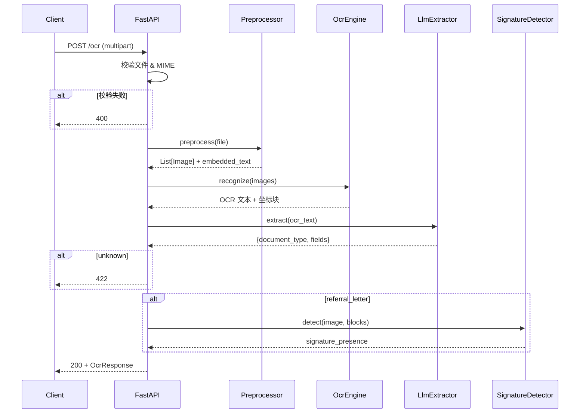

# Medical OCR API — 开发文档

---

## 目录

1. [项目概述](#1-项目概述)
2. [系统架构设计](#2-系统架构设计)
3. [技术选型](#3-技术选型)
4. [API 接口设计](#4-api-接口设计)
5. [数据流设计](#5-数据流设计)
6. [OCR 与文档解析管线](#6-ocr-与文档解析管线)
7. [LLM 分类与提取](#7-llm-分类与提取)
8. [签名检测](#8-签名检测)
9. [项目结构](#9-项目结构)
10. [部署与运行指南](#10-部署与运行指南)
11. [测试策略](#11-测试策略)
12. [可扩展性设计](#12-可扩展性设计)
13. [错误处理](#13-错误处理)
14. [附录](#14-附录)

---

## 1. 项目概述

### 1.1 背景

构建一个 **OCR 微服务**，通过单一 HTTP 端点 (`POST /ocr`) 接收医疗文档（图片/PDF），自动识别文档类型并返回结构化 JSON 数据，用于下游理赔审核（Claim Adjudication）。

### 1.2 核心流程（当前实际实现）

```
PDF/Image → 预处理 → OCR(Tesseract / pytesseract) → 文本归一化 → LLM(分类+提取) → 签名检测 → JSON 响应
```

**关键设计决策**：分类和字段提取不再使用正则/关键词规则引擎，而是统一由 LLM（OpenAI 兼容 API）完成。LLM 在单次调用中同时完成文档分类和结构化字段提取，返回 JSON。

### 1.3 支持的三类文档

| 内部代码 | 中文标签 | 关键提取字段 |
|----------|----------|-------------|
| `referral_letter` | 转诊信 | 患者姓名、供应商名称、签名检测、金额 |
| `medical_certificate` | 医疗证明 | 患者姓名/地址/生日、诊断、ICD 编码、MC 日期、天数 |
| `receipt` | 收据 | 患者姓名/地址/生日、供应商名称、税额、总金额 |

---

## 2. 系统架构设计

### 2.1 总体架构图

```mermaid
graph TB
    subgraph Client["客户端"]
        A[HTTP Client]
    end

    subgraph APIGateway["API 网关层"]
        B[FastAPI<br/>POST /ocr]
        B1[文件校验 & MIME 检查]
    end

    subgraph Pipeline["OCR 处理管线"]
        C[PDF Preprocessor<br/>PDF → Image]
        D[OCR Engine<br/>Tesseract (pytesseract)]
        E[Text Normalizer<br/>文本清洗]
    end

    subgraph AI["AI 分析层"]
        F[LLM Extractor<br/>分类 + 字段提取]
        G[Signature Detector<br/>手写签名检测]
    end

    subgraph Output["输出层"]
        H[Response Builder<br/>JSON 响应]
    end

    A --> B --> B1
    B1 -->|校验通过| C
    C --> D --> E
    E --> F
    F -->|referral_letter| G
    F --> H
    G --> H
    H --> A
```

### 2.2 架构分层说明

| 层级 | 职责 | 技术组件 |
|------|------|---------|
| **API 网关层** | 接收请求、参数校验、MIME 类型检查、错误响应 | FastAPI + Pydantic |
| **OCR 处理管线** | PDF 转图片、OCR 文字识别、文本标准化 | pdf2image / PyMuPDF + Tesseract (pytesseract) |
| **AI 分析层** | LLM 分类+提取、图像签名检测 | OpenAI API + OpenCV |
| **输出层** | 组装响应 JSON、耗时统计 | FastAPI Response Model |

### 2.3 设计原则

1. **管道模式**：预处理 → OCR → LLM → 签名 → 响应，线性可追踪
2. **单一 LLM 调用**：分类 + 提取合并为一次 API 调用，减少延迟和成本
3. **容错设计**：缺失字段返回 `null`，LLM 失败自动重试
4. **无状态服务**：不保存任何文档或状态，便于水平扩展

---

## 3. 技术选型

### 3.1 核心技术栈

| 类别 | 技术 | 版本 | 选型理由 |
|------|------|------|---------|
| **Web 框架** | FastAPI | ≥0.110 | 高性能异步框架，自动生成 OpenAPI 文档 |
| **OCR 引擎** | Tesseract (pytesseract) | system package + pytesseract | 轻量、易集成，需安装系统 tesseract-ocr |
| **OCR 引擎(备选)** | (无) | — | 轻量级备选方案已移除，当前仅支持 Tesseract (pytesseract) |
| **PDF 处理** | pdf2image + PyMuPDF | — | pdf2image 转图片；PyMuPDF 提取嵌入式文本 |
| **图像处理** | Pillow + OpenCV | — | 预处理（去噪、二值化、倾斜校正） |
| **LLM 提取** | OpenAI SDK | ≥1.0 | 兼容 OpenAI / DeepSeek 等任意 API |
| **测试** | pytest + httpx | — | 异步测试，与 FastAPI 深度集成 |
| **容器化** | Docker | — | 环境一致性 |

### 3.2 Python 依赖清单

```
fastapi>=0.110.0
uvicorn[standard]>=0.30.0
python-multipart>=0.0.12
python-dotenv>=1.0.0
pytesseract>=0.3
pdf2image>=1.17.0
PyMuPDF>=1.24.0
Pillow>=10.0.0
opencv-python-headless>=4.10.0
numpy>=1.26.0
pydantic>=2.0.0
openai>=1.0.0
httpx>=0.27.0
pytest>=8.0.0
pytest-asyncio>=0.24.0
```

### 3.3 系统依赖

```bash
# Ubuntu / Debian
sudo apt-get install -y poppler-utils
```

---

## 4. API 接口设计

### 4.1 端点定义

| 方法 | 路径 | Content-Type | 描述 |
|------|------|-------------|------|
| `POST` | `/ocr` | `multipart/form-data` | 上传文档并获取结构化提取结果 |
| `GET` | `/health` | — | 健康检查 |
| `GET` | `/` | — | 重定向到 Web UI |

### 4.2 请求规范

```http
POST /ocr HTTP/1.1
Content-Type: multipart/form-data

--boundary
Content-Disposition: form-data; name="file"; filename="referral_letter.pdf"
Content-Type: application/pdf

<binary data>
--boundary--
```

**支持格式**：`application/pdf`、`image/jpeg`、`image/png`、`image/tiff`

### 4.3 成功响应 (200 OK)

```json
{
  "message": "Processing completed.",
  "result": {
    "document_type": "referral_letter",
    "total_time": 3.04,
    "ocr_time": 1.82,
    "classification_time": 1.10,
    "extraction_time": 1.10,
    "finalJson": {
      "claimant_name": "John Smith",
      "provider_name": "City Medical Clinic",
      "signature_presence": true,
      "total_amount_paid": null,
      "total_approved_amount": null,
      "total_requested_amount": null
    }
  }
}
```

### 4.4 错误响应

| 状态码 | 响应体 | 触发条件 |
|--------|--------|---------|
| `400` | `{"error":"file_missing"}` | 无文件或 MIME 类型无效 |
| `422` | `{"error":"unsupported_document_type"}` | LLM 返回 unknown |
| `500` | `{"error":"internal_server_error"}` | 未处理异常 |

### 4.5 响应模型 (Pydantic)

```python
class DocumentType(str, Enum):
    REFERRAL_LETTER = "referral_letter"
    MEDICAL_CERTIFICATE = "medical_certificate"
    RECEIPT = "receipt"

class OcrResult(BaseModel):
    document_type: DocumentType
    total_time: float
    ocr_time: Optional[float] = None
    classification_time: Optional[float] = None
    extraction_time: Optional[float] = None
    finalJson: Dict[str, Any]

class OcrResponse(BaseModel):
    message: str
    result: OcrResult
```

---

## 5. 数据流设计

### 5.1 请求处理时序



### 5.2 数据结构流转

```
Raw File (PDF/PNG/JPG)
    │
    ▼
PIL Image(s)              ← pdf2image / PIL.Image.open
    │
    ▼
OcrResult                 ← OcrEngine.recognize()
  ├── full_text: str
  ├── blocks: List[OcrBlock]
  └── embedded_text: str | None
    │
    ▼
normalized_text: str      ← TextNormalizer.normalize()
    │
    ▼
LLM Response              ← LlmExtractor.extract()
  ├── document_type: str
  └── fields: dict
    │
    ▼
OcrResponse JSON          ← FastAPI 序列化
```

---

## 6. OCR 与文档解析管线

### 6.1 文件预处理 (`app/pipeline/preprocessor.py`)

```python
class DocumentPreprocessor:
    def __init__(self, dpi: int = 300):
        self.dpi = dpi
        self.embedded_text: Optional[str] = None

    def preprocess(self, file: UploadFile) -> List[Image.Image]:
        # PDF: 先尝试提取嵌入式文本，再转图片
        if file.content_type == "application/pdf":
            pdf_bytes = file.file.read()
            extracted_text = self._extract_text_from_pdf(pdf_bytes)
            if self._is_text_layer_usable(extracted_text):
                self.embedded_text = extracted_text
            images = convert_from_bytes(pdf_bytes, dpi=self.dpi)
        else:
            images = [Image.open(io.BytesIO(file.file.read()))]
        return images  # PaddleOCR 自带预处理管线，无需额外增强
```

**预处理流程**：
1. **PDF 文本提取**：用 PyMuPDF 尝试提取嵌入式文本层（扫描件为空则跳过）
2. **PDF 渲染**：pdf2image 将 PDF 转为 300 DPI 图片
3. **无额外图像增强**：默认不额外增强；根据后端（例如 Tesseract）特性可按需添加去噪/二值化/倾斜校正等预处理。

### 6.2 OCR 引擎 (`app/pipeline/ocr_engine.py`)

```python
class OcrEngine:
    def __init__(self, engine_type: str = "tesseract"):
        # Current implementation uses Tesseract via pytesseract
        if engine_type != "tesseract":
            raise ValueError(f"Unsupported engine: {engine_type}")

    def recognize(self, images, embedded_text=None) -> OcrResult:
        # The implementation delegates to pytesseract.image_to_data
        # and returns an OcrResult with blocks containing text, confidence, bbox.
        pass
```

**关键点**：
- 使用 Tesseract 时，请使用 `pytesseract.image_to_data` 获取逐词位置信息和置信度。
- 不再依赖 PaddleOCR / PaddlePaddle；请确保传入图像为 RGB（灰度图需 `img.convert("RGB")`）。

### 6.3 文本标准化 (`app/pipeline/normalizer.py`)

```python
class TextNormalizer:
    @staticmethod
    def normalize(text: str) -> str:
        text = text.replace("\t", " ").replace("\r", "")
        return re.sub(r"\s+", " ", text).strip()
```

---

## 7. LLM 分类与提取

### 7.1 设计理念

**不再使用**正则/关键词规则引擎进行文档分类和字段提取。改为由 LLM 在单次 API 调用中同时完成：

1. 文档类型分类（`referral_letter` / `medical_certificate` / `receipt` / `unknown`）
2. 结构化字段提取（返回完整 JSON，含所有字段，缺失填 `null`）

### 7.2 LLM 提取器 (`app/extraction/llm_extractor.py`)

```python
SYSTEM_PROMPT = """You are a medical document parser. ...

TEMPLATES (copy-paste the correct one and fill):

referral_letter:
{"document_type":"referral_letter","fields":{"claimant_name":"...","provider_name":"...",
  "signature_presence":false,"total_amount_paid":null,"total_approved_amount":null,
  "total_requested_amount":null}}

medical_certificate:
{"document_type":"medical_certificate","fields":{"claimant_name":"...","claimant_address":"...",
  ...}}

receipt:
{"document_type":"receipt","fields":{"claimant_name":"...","claimant_address":"...",...}}

RULES:
- submission_date_time = HOSPITAL ADMISSION DATE. null if no admission date.
- discharge_date_time = HOSPITAL DISCHARGE DATE. null if no discharge date.
- date_of_mc = MC ISSUE / CONSULTATION DATE. null if no MC date.
- provider_name: extract from letterhead/header. Must NOT contain "Fullerton Health".
  OCR misreads "@" as "o"/"0"/"a"/"at" — fix them: "Healthway Screening 0 Centrepoint" →
  "Healthway Screening @ Centrepoint".
- Amounts: output as integer. Truncate decimal part (e.g. "49.28" → 49).
- Dates: DD/MM/YYYY format.
- Booleans: true or false.
- Fix OCR errors: "JOHN DOE D." → "JOHN DOE", "#01-0]" → "#01-01",
  "#01-0" → "#01-00", "0rchard" → "Orchard", "Slngapore" → "Singapore"."""


class LlmExtractor:
    def extract(self, ocr_text: str) -> Dict[str, Any]:
        # 1. 截断过长文本（LLM_MAX_INPUT_CHARS）
        # 2. 调用 LLM API（OpenAI 兼容）
        # 3. 解析 JSON 响应（支持 markdown 代码块）
        # 4. 类型强制转换（coerce）—— LLM 已输出完整 schema 含 null
        # 5. 空响应自动重试一次
```

### 7.3 设计变化（v2）

**不再使用**字段别名映射和 `_normalize_fields` 补全机制。改为：

- **Prompt 模板化**：LLM 直接复制完整 JSON 模板填值，缺失字段填 `null`，后端不再补字段
- **后端只做 `_coerce_value`**：遍历 LLM 返回的 fields，做类型强转 + OCR 错误修复

### 7.4 OCR 错误修复（双层防护）

| 层级 | 修复内容 |
|------|---------|
| **Prompt** | 引导 LLM 修复：名称尾部杂讯（`JOHN DOE D.` → `JOHN DOE`）、新加坡门牌号（`#01-0]` → `#01-01`）、`@` 符号误识别 |
| **`_coerce_value`** | 正则兜底：`claimant_name` 去尾 `\s+[A-Z]\.$`、`claimant_address` 修复 `#XX-X]` 和 `#XX-X` 格式 |

### 7.5 类型强制转换

- **金额字段**：去除 `$`、逗号，截断小数部分，转为整数
- **日期字段**：统一为 `DD/MM/YYYY` 格式
- **布尔字段**：`signature_presence` 转为 `true/false/null`
- **整数字段**：`mc_days` 去除非数字字符后转整数
- **字符串字段**：`claimant_name` 去尾部杂讯、`claimant_address` 修复门牌号

### 7.6 容错机制

- LLM 返回空响应时自动重试一次（间隔 0.5s）
- JSON 解析失败时尝试从 markdown 代码块提取
- 最终失败返回 `{"document_type": "unknown", "fields": {}}`

### 7.7 配置项

```bash
# .env
LLM_API_KEY=sk-xxx          # 必需
LLM_MODEL=deepseek-v4-flash # LLM 模型名
LLM_BASE_URL=http://...     # 兼容任意 OpenAI 兼容 API
LLM_MAX_INPUT_CHARS=8000    # OCR 文本截断长度
LLM_MAX_TOKENS=4096         # LLM 最大输出 token
```

---

## 8. 签名检测

### 8.1 签名检测器 (`app/extraction/signature.py`)

**仅对 `referral_letter` 类型触发**，采用多特征融合策略：

```python
class SignatureDetector:
    def detect(self, image: Image.Image, ocr_blocks) -> bool:
        # 策略 0：电子生成文档直接返回 false
        # 策略 1：正则单词边界匹配签名关键词（排除 design/assigned 等误判）
        # 策略 2：在签名标签附近区域做多特征图像分析
```

### 8.2 关键词匹配（防误判）

- 使用正则 `\b(signature|signed|signatory|signer)\b` 单词边界匹配
- 显式排除误判词：`design`、`assigned`、`significant`、`signal`、`resign` 等
- 电子文档声明（`electronically generated`、`digitally signed` 等）直接返回 `false`

### 8.3 多特征手写笔迹评分

采用 **4 维加权评分**（每维 0.0~1.0），最终平均分 ≥ 0.70 才判定为手写签名：

| 特征 | 算法 | 判据 |
|------|------|------|
| **面积离散度** | 轮廓面积 CV 值 | CV > 1.0 → 1.0, CV > 0.7 → 0.5 |
| **笔画细长比** | 外接矩形宽高比 | 高宽比 > 3 的细长轮廓占比 |
| **曲率实心度** | 圆形度 + 凸包实心度 | 低圆形度 + 低实心度 → 手写弯曲笔画 |
| **墨水密度** | 轮廓面积和 / 区域面积 | 2%~30% → 1.0，排除印章（>40%）和噪声（<0.5%） |

### 8.4 排除检测

在评分前先做排除，命中则直接返回 `false`：

- **印章/公章**：Hough 圆检测，发现圆形即排除
- **条码/二维码**：Canny 边缘投影方差分析，检测密集交替边缘

### 8.5 区域定位策略

| 策略 | 条件 | 区域 |
|------|------|------|
| 精确定位 | 有签名关键词 | 关键词右侧 3×3 区域 |
| 精确定位 | 有 footer 提示（name/date/doctor） | 提示词右侧 3×3 区域 |
| 回退 | 以上皆无 | 页面底部 65%~83% 窄条 |

---

## 9. 项目结构

```
medical-ocr-api/
├── app/
│   ├── __init__.py
│   ├── main.py                    # FastAPI 入口，路由注册，异常处理
│   ├── config.py                  # 环境变量配置（dotenv 自动加载）
│   ├── models/
│   │   ├── __init__.py
│   │   └── response.py            # Pydantic 响应模型
│   ├── api/
│   │   ├── __init__.py
│   │   └── ocr.py                 # POST /ocr + GET /health 端点
│   ├── pipeline/
│   │   ├── __init__.py
│   │   ├── preprocessor.py        # PDF→图片、图像增强
│   │   ├── ocr_engine.py          # Tesseract (pytesseract) 抽象层
│   │   ├── ocr_types.py           # OcrBlock / OcrResult 数据类
│   │   └── normalizer.py          # 文本清洗
│   ├── extraction/
│   │   ├── __init__.py
│   │   ├── llm_extractor.py       # LLM 分类+提取（核心模块）
│   │   └── signature.py           # 手写签名检测
│   ├── static/
│   │   └── index.html             # Web UI
│   └── utils/
│       └── __init__.py
├── tests/
│   ├── __init__.py
│   ├── conftest.py                # TestClient fixture
│   └── test_api.py                # API 端点集成测试
├── Example/                       # 示例文档
│   ├── referral_letter.pdf
│   ├── medical_certificate.pdf
│   └── receipt.pdf
├── doc/
│   └── 开发文档.md
├── Dockerfile
├── docker-compose.yml
├── requirements.txt
├── .env.example
└── README.md
```

---

## 10. 部署与运行指南

### 10.1 环境要求

- **Python**: 3.10+
- **系统依赖**: Poppler (`poppler-utils`)

### 10.2 本地开发

```bash
# 1. 安装系统依赖
sudo apt-get install -y poppler-utils

# 2. 创建虚拟环境
python -m venv .venv
source .venv/bin/activate

# 3. 安装 Python 依赖
pip install -r requirements.txt

# 4. 配置环境变量
cp .env.example .env
# 编辑 .env，设置 LLM_API_KEY（必需）

# 5. 启动服务
uvicorn app.main:app --host 0.0.0.0 --port 8000 --reload
```

### 10.3 Docker 部署

```bash
docker-compose up -d --build
```

### 10.4 示例请求

```bash
# 转诊信
curl -X POST http://localhost:8000/ocr \
  -F "file=@Example/referral_letter.pdf"

# 医疗证明
curl -X POST http://localhost:8000/ocr \
  -F "file=@Example/medical_certificate.pdf"

# 收据
curl -X POST http://localhost:8000/ocr \
  -F "file=@Example/receipt.pdf"

# 健康检查
curl http://localhost:8000/health
```

---

## 11. 测试策略

### 11.1 当前测试覆盖

| 测试 | 文件 | 描述 |
|------|------|------|
| `test_health_check` | `test_api.py` | 验证 /health 端点 |
| `test_missing_file` | `test_api.py` | 无文件 → 400 |
| `test_invalid_mime` | `test_api.py` | 非支持格式 → 400 |
| `test_unsupported_document` | `test_api.py` | mock LLM 返回 unknown → 422 |
| `test_empty_filename` | `test_api.py` | 空文件名 → 422 |

### 11.2 运行测试

```bash
# 全部测试
pytest tests/ -v

# 带覆盖率
pytest tests/ --cov=app --cov-report=html
```

---

## 12. 可扩展性设计

### 12.1 添加新文档类型

只需修改 LLM prompt 和响应模型：

1. 在 `SYSTEM_PROMPT` 中添加新类型的 JSON 模板
2. 在 `DocumentType` 枚举中添加新类型
3. 如需新字段的后端类型转换，在 `_coerce_value` 中添加规则

### 12.2 切换 OCR 引擎

```bash
# OCR engine is Tesseract by default
OCR_ENGINE=tesseract
```

### 12.3 切换 LLM 提供商

```bash
LLM_MODEL=gpt-4o                  # OpenAI
LLM_MODEL=deepseek-v4-flash       # DeepSeek
LLM_BASE_URL=http://your-api/v1   # 任意兼容 API
```

---

## 13. 错误处理

### 13.1 异常处理链

```python
# app/main.py
@app.exception_handler(UnsupportedDocumentError)
async def unsupported_document_handler(...):
    return JSONResponse(status_code=422, content={"error": "unsupported_document_type"})

@app.exception_handler(FileValidationError)
async def file_validation_handler(...):
    return JSONResponse(status_code=400, content={"error": "file_missing"})

@app.exception_handler(Exception)
async def general_exception_handler(...):
    logger.error(f"Unhandled exception: {exc}", exc_info=True)
    return JSONResponse(status_code=500, content={"error": "internal_server_error"})
```

### 13.2 容错策略

| 场景 | 策略 |
|------|------|
| OCR 识别为空 | 正常处理，LLM 返回 unknown |
| LLM API 超时 | 自动重试一次 |
| LLM 返回空响应 | 自动重试一次，仍失败返回 unknown |
| LLM 返回非标准字段 | 忽略未知 key，LLM 按模板输出的标准字段直接通过 |
| LLM 返回非 JSON | 从 markdown 代码块提取 JSON |
| 金额/日期格式异常 | 类型强制转换，失败返回 null |
| 图片签名检测异常 | 捕获异常返回 false |

---

## 14. 附录

### 14.1 环境变量完整列表

| 变量 | 默认值 | 描述 |
|------|--------|------|
| `OCR_ENGINE` | `tesseract` | OCR 引擎: tesseract |
| `MAX_FILE_SIZE` | `20971520` | 最大上传文件大小 (bytes) |
| `LOG_LEVEL` | `INFO` | 日志级别 |
| `LLM_API_KEY` | (空) | LLM API 密钥（必需） |
| `LLM_MODEL` | `gpt-4o` | LLM 模型名 |
| `LLM_BASE_URL` | (空) | LLM API 地址（可选，兼容 OpenAI 格式） |
| `LLM_MAX_INPUT_CHARS` | `8000` | OCR 文本截断长度 |
| `LLM_MAX_TOKENS` | `1024` | LLM 最大输出 token |

### 14.2 已知问题

1. **已迁移**：项目已从 PaddleOCR/PaddlePaddle 迁移到 Tesseract (pytesseract)。
2. **DeepSeek 不支持 `response_format`**：代码已移除 `response_format={"type": "json_object"}` 参数
3. **LLM 代理间歇返回空响应**：已添加自动重试机制

### 14.3 变更历史

| 日期 | 变更 |
|------|------|
| 2026-08-03 | LLM prompt 改为模板式：LLM 直接输出完整 JSON（含 null），后端不再做字段补全 |
| 2026-08-03 | 移除 `_FIELD_ALIASES` 别名映射和 `_CANONICAL_FIELDS` 补全机制 |
| 2026-08-03 | `_coerce_value` 增加 `claimant_name` 尾部杂讯清理和 `claimant_address` 新加坡门牌号修复 |
| 2026-08-03 | 签名检测重写：正则单词边界匹配 + 4 维加权评分 + 印章/条码排除 |
| 2026-08-03 | 金额提取修复：prompt 明确 `"49.28" → 49` 取整而非去 `.` 字符 |
| 2026-08-03 | `provider_name` 增加 `@` 符号 OCR 修复规则 |
| 2026-08-03 | 用 LLM 替换分类器+提取器（正则规则全部移除） |
| 2026-08-03 | 迁移到 Tesseract (pytesseract) 并移除 Paddle 依赖 |
| 2026-08-03 | 添加 `python-dotenv` 自动加载 `.env` |
| 2026-08-03 | 添加 LLM 字段别名映射和类型强制转换 |
| 2026-08-03 | 移除 `enhance()` 图像预处理（默认不额外增强，按需添加 engine-specific 预处理） |
| 2026-08-03 | 添加 LLM 空响应重试机制 |