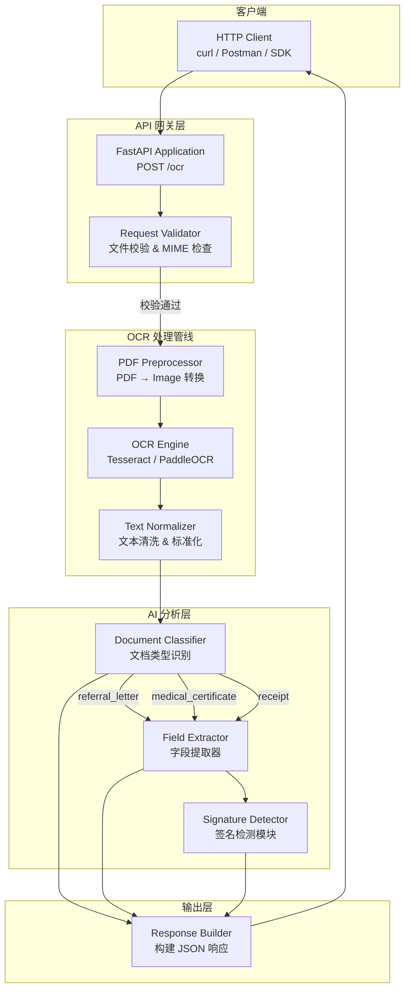
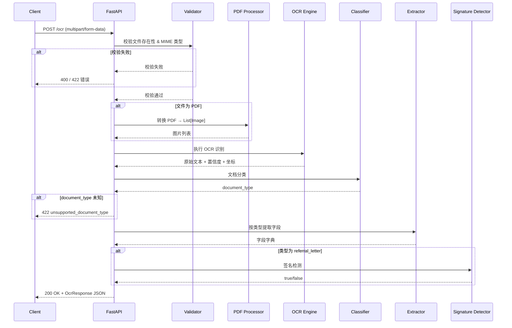
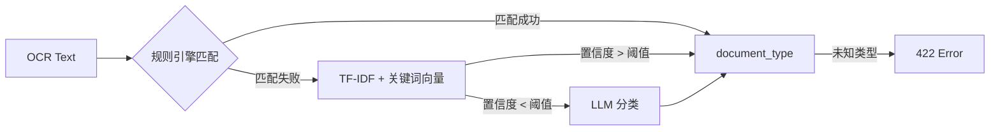

# Medical OCR API — 开发文档

---

## 目录

1. [项目概述](#1-项目概述)
2. [系统架构设计](#2-系统架构设计)
3. [技术选型](#3-技术选型)
4. [API 接口设计](#4-api-接口设计)
5. [数据流设计](#5-数据流设计)
6. [OCR 与文档解析管线](#6-ocr-与文档解析管线)
7. [文档分类策略](#7-文档分类策略)
8. [字段提取策略](#8-字段提取策略)
9. [项目结构](#9-项目结构)
10. [部署与运行指南](#10-部署与运行指南)
11. [测试策略](#11-测试策略)
12. [可扩展性设计](#12-可扩展性设计)
13. [错误处理](#13-错误处理)
14. [性能优化](#14-性能优化)
15. [附录](#15-附录)

---

## 1. 项目概述

### 1.1 背景

Fullerton Health 工程团队每日处理数千份医疗单据。本项目旨在构建一个 **OCR 微服务**，通过单一 HTTP 端点 (`POST /ocr`) 接收医疗文档（图片/PDF），自动识别文档类型，并返回结构化 JSON 数据，用于下游理赔审核（Claim Adjudication）。

### 1.2 核心目标

| 目标 | 描述 |
|------|------|
| **文档分类** | 自动区分三类文档：Referral Letter（转诊信）、Medical Certificate（医疗证明）、Receipt（收据） |
| **信息提取** | 从各类文档中提取姓名、金额、日期、ICD 编码等关键字段 |
| **API 服务** | 提供标准 RESTful API，支持 multipart/form-data 上传 |
| **可扩展** | 易于添加新文档类型和新提取字段 |

### 1.3 支持的三类文档

| 内部代码 | 中文标签 | 关键提取字段 |
|----------|----------|-------------|
| `referral_letter` | 转诊信 | 患者姓名、供应商名称、签名检测、金额 |
| `medical_certificate` | 医疗证明 | 患者姓名/地址/生日、诊断、ICD 编码、MC 日期、天数 |
| `receipt` | 收据 | 患者姓名/地址/生日、供应商名称、税额、总金额 |

### 1.4 样本文档特征与实现约束

基于 `Example/` 目录中的三份真实样本，可确认实现需要优先适配以下现实约束：

1. **三份样本均为扫描件 PDF**：PyMuPDF 无法直接提取嵌入式文本，因此主路径必须是 `PDF → 图片 → OCR`，不能依赖 PDF 原生文本层。
2. **Referral Letter 样本是自由文本信函**：正文包含转诊语义（如 `Kindly assist`、`mole check`、医生落款），但**不包含** `total_amount_paid` 等金额字段；因此该类型需要返回金额字段为 `null`，不能因为缺少金额而误判为 unsupported。
3. **Medical Certificate 样本是电子生成单据**：底部明确写有 `This medical certificate is electronically generated. No signature is required.`，因此该类型不应进入签名检测流程。
4. **Receipt 样本金额字段为票据布局**：常见标签包括 `TAX INVOICE`、`GST @ 8%`、`TOTAL AMOUNT PAID`、`TOTAL BALANCE DUE`；金额提取必须支持 OCR 中的空格、冒号、对齐点和括号负数。
5. **姓名和地址并不总是通过统一标签出现**：例如收据样本中姓名直接出现在付款人区域，地址为多行街道地址；提取规则必须同时支持“标签驱动”与“版式邻近”两类模式。

---

## 2. 系统架构设计

### 2.1 总体架构图



### 2.2 架构分层说明

| 层级 | 职责 | 技术组件 |
|------|------|---------|
| **API 网关层** | 接收请求、参数校验、MIME 类型检查、错误响应 | FastAPI + Pydantic |
| **OCR 处理管线** | PDF 转图片、OCR 文字识别、文本标准化 | pdf2image / PyMuPDF + Tesseract/PaddleOCR |
| **AI 分析层** | 文档分类、字段提取、签名检测 | 规则引擎 + 正则 + 可选 LLM |
| **输出层** | 组装响应 JSON、耗时统计 | FastAPI Response Model |

### 2.3 设计原则

1. **关注点分离**：每层职责单一，便于测试和维护
2. **管道模式**：OCR → 分类 → 提取 形成线性处理管道，易于扩展
3. **策略模式**：每种文档类型对应独立的提取策略（Extractor）
4. **容错设计**：任一环节失败不阻塞整体流程，缺失字段返回 `null`
5. **无状态服务**：服务本身不保存任何文档或状态，便于水平扩展

---

## 3. 技术选型

### 3.1 核心技术栈

| 类别 | 技术 | 版本 | 选型理由 |
|------|------|------|---------|
| **Web 框架** | FastAPI | ≥0.110 | 高性能异步框架，自动生成 OpenAPI 文档，原生支持文件上传 |
| **OCR 引擎** | PaddleOCR | ≥2.8 | 中英文识别准确率高，支持表格识别，离线运行 |
| **OCR 引擎(备选)** | Tesseract (pytesseract) | ≥5.0 | 开源成熟，轻量级，作为备选方案 |
| **PDF 处理** | pdf2image + PyMuPDF | — | pdf2image 将 PDF 转图片；PyMuPDF 提取嵌入式文本 |
| **图像处理** | Pillow + OpenCV | — | 图像预处理（去噪、二值化、旋转校正） |
| **分类/NLP** | scikit-learn / regex | — | 基于关键词 + 正则的规则分类；可扩展为 LLM 分类 |
| **LLM（可选）** | OpenAI GPT-4o / 开源 LLM | — | 复杂字段提取的备选方案 |
| **测试** | pytest + httpx | — | 异步测试支持，与 FastAPI 深度集成 |
| **容器化** | Docker | — | 环境一致性，便于部署 |

### 3.2 Python 依赖清单

```
# requirements.txt
fastapi==0.115.0
uvicorn[standard]==0.30.0
python-multipart==0.0.12
paddleocr>=2.8.0
paddlepaddle>=3.0.0
pdf2image==1.17.0
PyMuPDF==1.24.0
Pillow>=10.0.0
opencv-python-headless==4.10.0
numpy>=1.26.0
scikit-learn>=1.5.0
pydantic>=2.0.0
httpx>=0.27.0
pytest>=8.0.0
pytest-asyncio>=0.24.0
```

---

## 4. API 接口设计

### 4.1 端点定义

| 方法 | 路径 | Content-Type | 描述 |
|------|------|-------------|------|
| `POST` | `/ocr` | `multipart/form-data` | 上传文档并获取 OCR 提取结果 |
| `GET` | `/health` | — | 健康检查端点 |

### 4.2 请求规范

```http
POST /ocr HTTP/1.1
Host: localhost:8000
Content-Type: multipart/form-data

--boundary
Content-Disposition: form-data; name="file"; filename="referral_letter.pdf"
Content-Type: application/pdf

<binary data>
--boundary--
```

**支持的文件格式**：
- `application/pdf` — PDF 文档
- `image/jpeg` — JPEG 图片
- `image/png` — PNG 图片
- `image/tiff` — TIFF 图片（可选）

**文件大小限制**：默认 20MB（可通过环境变量配置）

### 4.3 成功响应 (200 OK)

```json
{
  "message": "Processing completed.",
  "result": {
    "document_type": "referral_letter",
    "total_time": 3.04,
    "ocr_time": 1.82,
    "classification_time": 0.12,
    "extraction_time": 1.10,
    "finalJson": {
      "claimant_name": "John Smith",
      "provider_name": "City Medical Clinic",
      "signature_presence": true,
      "total_amount_paid": 3000000,
      "total_approved_amount": 3000000,
      "total_requested_amount": 3000000
    }
  }
}
```

### 4.4 错误响应

#### 4.4.1 缺少文件 / MIME 类型无效 (400)

```json
{
  "error": "file_missing"
}
```

#### 4.4.2 不支持的文档类型 (422)

```json
{
  "error": "unsupported_document_type"
}
```

#### 4.4.3 内部服务器错误 (500)

```json
{
  "error": "internal_server_error"
}
```

### 4.5 响应模型定义 (Pydantic)

```python
from pydantic import BaseModel
from typing import Optional, Dict, Any
from enum import Enum

class DocumentType(str, Enum):
    REFERRAL_LETTER = "referral_letter"
    MEDICAL_CERTIFICATE = "medical_certificate"
    RECEIPT = "receipt"

class ReferralLetterFields(BaseModel):
    claimant_name: Optional[str] = None
    provider_name: Optional[str] = None
    signature_presence: Optional[bool] = None
    total_amount_paid: Optional[int] = None
    total_approved_amount: Optional[int] = None
    total_requested_amount: Optional[int] = None

class MedicalCertificateFields(BaseModel):
    claimant_name: Optional[str] = None
    claimant_address: Optional[str] = None
    claimant_date_of_birth: Optional[str] = None
    diagnosis_name: Optional[str] = None
    discharge_date_time: Optional[str] = None
    icd_code: Optional[str] = None
    provider_name: Optional[str] = None
    submission_date_time: Optional[str] = None
    date_of_mc: Optional[str] = None
    mc_days: Optional[int] = None

class ReceiptFields(BaseModel):
    claimant_name: Optional[str] = None
    claimant_address: Optional[str] = None
    claimant_date_of_birth: Optional[str] = None
    provider_name: Optional[str] = None
    tax_amount: Optional[int] = None
    total_amount: Optional[int] = None

class OcrResult(BaseModel):
    document_type: DocumentType
    total_time: float
    ocr_time: Optional[float] = None
    classification_time: Optional[float] = None
    extraction_time: Optional[float] = None
    finalJson: Dict[str, Any]

class OcrResponse(BaseModel):
    message: str
    result: OcrResult

class ErrorResponse(BaseModel):
    error: str
```

---

## 5. 数据流设计

### 5.1 请求处理流程



### 5.2 数据结构流转

```
┌─────────────┐    ┌──────────────┐    ┌─────────────────┐    ┌──────────────────┐
│  Raw File   │───▶│  Image(s)    │───▶│  OCR Text +     │───▶│  Structured      │
│  (PDF/PNG/  │    │  (PIL Image  │    │  Bounding Boxes │    │  JSON Response   │
│   JPG)      │    │   Objects)   │    │  + Confidence   │    │                  │
└─────────────┘    └──────────────┘    └─────────────────┘    └──────────────────┘
                         │                      │                      │
                    pdf2image /           PaddleOCR /            Regex + Rules
                    PyMuPDF               Tesseract              + LLM(fallback)
```

---

## 6. OCR 与文档解析管线

### 6.1 文件预处理

```python
# 伪代码：预处理流程
class DocumentPreprocessor:
    SUPPORTED_MIMES = {
        "application/pdf",
        "image/jpeg",
        "image/png",
        "image/tiff",
    }

    def preprocess(self, file: UploadFile) -> List[Image.Image]:
        """
        1. 校验 MIME 类型
        2. 如果是 PDF：优先尝试提取嵌入式文本；若为空或文本密度过低，则转为图片列表
        3. 如果是图片 → 直接返回
        4. 图像预处理（去噪、增强对比度、倾斜校正）
        """
        if file.content_type == "application/pdf":
            pdf_bytes = file.file.read()
            extracted_text = self.extract_text_from_pdf(pdf_bytes)

            # Example 样本属于扫描件，文本层为空，因此这里会稳定回退到 OCR。
            if self._is_text_layer_usable(extracted_text):
                self.embedded_text = extracted_text

            images = pdf2image.convert_from_bytes(
                pdf_bytes,
                dpi=300  # 高 DPI 提高扫描件 OCR 准确率
            )
        else:
            images = [Image.open(file.file)]

        # 图像增强
        return [self.enhance(img) for img in images]

    def extract_text_from_pdf(self, pdf_bytes: bytes) -> str:
        """尝试提取 PDF 内嵌文本层，用于可搜索 PDF 的快速路径。"""
        doc = fitz.open(stream=pdf_bytes, filetype="pdf")
        return "\n".join(page.get_text() for page in doc)

    def _is_text_layer_usable(self, text: str) -> bool:
        """扫描件 PDF 通常文本层为空或只有极少字符。"""
        normalized = re.sub(r"\s+", "", text or "")
        return len(normalized) >= 40

    def enhance(self, image: Image.Image) -> Image.Image:
        """图像增强：灰度化 → 自适应二值化 → 去噪 → 倾斜校正"""
        gray = cv2.cvtColor(np.array(image), cv2.COLOR_RGB2GRAY)
        binary = cv2.adaptiveThreshold(
            gray, 255,
            cv2.ADAPTIVE_THRESH_GAUSSIAN_C,
            cv2.THRESH_BINARY, 11, 2
        )
        denoised = cv2.fastNlMeansDenoising(binary)
        deskewed = self.correct_skew(denoised)
        return Image.fromarray(deskewed)

    def correct_skew(self, image: np.ndarray) -> np.ndarray:
        """对扫描件做轻量级倾斜校正，降低票据与证书类文档的 OCR 错误率。"""
        coords = np.column_stack(np.where(image < 250))
        if len(coords) == 0:
            return image

        angle = cv2.minAreaRect(coords)[-1]
        if angle < -45:
            angle = 90 + angle

        h, w = image.shape[:2]
        center = (w // 2, h // 2)
        matrix = cv2.getRotationMatrix2D(center, angle, 1.0)
        return cv2.warpAffine(
            image,
            matrix,
            (w, h),
            flags=cv2.INTER_CUBIC,
            borderMode=cv2.BORDER_REPLICATE,
        )
```

### 6.2 OCR 引擎

```python
class OcrEngine:
    """OCR 引擎抽象层，支持切换不同引擎"""

    def __init__(self, engine: str = "paddleocr"):
        if engine == "paddleocr":
            self.engine = PaddleOCR(
                use_angle_cls=True,  # 文本方向分类
                lang='en',           # 英文识别
                use_gpu=False,       # CPU 模式（Docker 兼容）
                show_log=False
            )
        elif engine == "tesseract":
            self.engine = "tesseract"
        else:
            raise ValueError(f"Unsupported engine: {engine}")

    def recognize(self, images: List[Image.Image]) -> OcrResult:
        """
        对每张图片执行 OCR，返回：
        - full_text: 拼接后的完整文本
        - blocks: 每个文本块（文本、坐标、置信度）
        """
        all_blocks = []
        for img in images:
            result = self.engine.ocr(np.array(img), cls=True)
            if result and result[0]:
                for line in result[0]:
                    bbox, (text, confidence) = line
                    all_blocks.append(OcrBlock(
                        text=text,
                        confidence=confidence,
                        bbox=bbox
                    ))

        full_text = "\n".join([b.text for b in all_blocks])
        return OcrResult(full_text=full_text, blocks=all_blocks)
```

### 6.3 文本标准化

```python
class TextNormalizer:
    """文本清洗与标准化"""

    @staticmethod
    def normalize(text: str) -> str:
        """统一处理 OCR 常见错误"""
        replacements = {
            # 常见 OCR 混淆字符
            '０': '0', '１': '1', '２': '2', '３': '3', '４': '4',
            '５': '5', '６': '6', '７': '7', '８': '8', '９': '9',
            'Ｏ': 'O', '０': '0', 'Ｉ': 'I', 'ｌ': 'l',
            # 移除多余空白
            '\t': ' ', '\r': '',
        }
        for old, new in replacements.items():
            text = text.replace(old, new)

        # 合并多余空格
        text = re.sub(r'\s+', ' ', text)
        return text.strip()
```

---

## 7. 文档分类策略

### 7.1 分类架构

采用 **两级分类策略**：规则引擎（优先）→ 语义分类（回退）



### 7.2 规则引擎

```python
class DocumentClassifier:
    """基于关键词 + 正则的规则分类器"""

    TYPE_PATTERNS = {
        "referral_letter": {
            "keywords": [
                "referral", "referred", "referring physician",
                "refer to", "specialist", "consultation",
                "referral letter", "kindly assist", "dear dr",
                "kind regards", "clinic", "hospital", "转诊"
            ],
            "required_fields": [
                r"(dear\s+dr|dear\s+doctor)",
                r"(kindly\s+assist|please\s+see|refer(?:red)?\s+for)",
                r"(dr\.?\s+[A-Z]+|doctor)",
            ],
            "exclude_keywords": [
                "medical certificate",
                "tax invoice",
                "subtotal",
                "gst @",
            ]
        },
        "medical_certificate": {
            "keywords": [
                "medical certificate", "certification", "diagnosis",
                "ICD", "discharge", "MC", "medical leave",
                "fit for work", "medical officer", "digital medical certificate",
                "electronically generated", "hospital/clinic", "病假"
            ],
            "required_fields": [
                r"medical\s+certificate",
                r"(admitted\s+on|discharged\s+on|date\s+of\s+mc)",
                r"(\d+)\s+days?",
            ],
            "exclude_keywords": ["tax invoice", "subtotal", "kind regards"]
        },
        "receipt": {
            "keywords": [
                "receipt", "invoice", "tax invoice", "payment",
                "total", "subtotal", "GST", "amount due",
                "cash", "credit card", "total amount paid",
                "total balance due", "visit date/time", "bill date", "收据", "发票"
            ],
            "required_fields": [
                r"tax\s+invoice",
                r"gst\s*@\s*\d+%",
                r"total\s+(amount\s+paid|charges\s+after\s+gst|balance\s+due)",
            ],
            "exclude_keywords": ["medical certificate", "diagnosis", "referral"]
        }
    }

    def classify(self, ocr_text: str) -> Tuple[str, float]:
        """
        返回 (document_type, confidence)
        采用加权打分机制，结合关键词匹配和字段模式匹配
        """
        scores = {}
        for doc_type, patterns in self.TYPE_PATTERNS.items():
            score = self._calculate_score(ocr_text, patterns)
            scores[doc_type] = score

        best_type = max(scores, key=scores.get)
        confidence = scores[best_type]

        if confidence < 0.3:
            return "unknown", 0.0

        return best_type, min(confidence, 1.0)

    def _calculate_score(self, text: str, patterns: dict) -> float:
        """计算文档匹配得分"""
        text_lower = text.lower()
        if any(kw.lower() in text_lower for kw in patterns["exclude_keywords"]):
            hard_conflicts = {
                "tax invoice",
                "medical certificate",
            }
            if any(conflict in text_lower for conflict in hard_conflicts):
                return 0.0

        keyword_score = sum(
            1 for kw in patterns["keywords"]
            if kw.lower() in text_lower
        ) / max(len(patterns["keywords"]), 1)

        field_score = sum(
            1 for pat in patterns["required_fields"]
            if re.search(pat, text_lower)
        ) / max(len(patterns["required_fields"]), 1)

        exclude_penalty = any(
            kw.lower() in text_lower
            for kw in patterns["exclude_keywords"]
        )

        score = 0.6 * keyword_score + 0.4 * field_score
        if exclude_penalty:
            score *= 0.5

        return score
```

### 7.3 分类阈值

| 场景 | 阈值 | 动作 |
|------|------|------|
| 置信度 ≥ 0.6 | 高置信度 | 直接采用规则结果 |
| 0.3 ≤ 置信度 < 0.6 | 中置信度 | 启用 TF-IDF 二次验证 |
| 置信度 < 0.3 | 低置信度 | 返回 `unknown` → 422 错误 |

### 7.4 针对 Example 样本的分类落地规则

为保证能稳定识别 `Example/` 中的三份样本，分类器需要额外遵循以下落地规则：

1. **Referral Letter**：看到 `Dear Dr`、`Kind regards`、医生姓名落款、诊所抬头、正文转诊语义时，即使没有金额字段，也应判为 `referral_letter`。
2. **Medical Certificate**：看到 `Digital Medical Certificate`、`This medical certificate is electronically generated`、`X days from <date> to <date>` 时，应高置信度判为 `medical_certificate`。
3. **Receipt**：看到 `TAX INVOICE`、`GST @ 8%`、`TOTAL AMOUNT PAID`、`TOTAL BALANCE DUE` 任意组合时，应优先判为 `receipt`。
4. **冲突消解**：`invoice` 和 `receipt` 关键词权重高于普通 `clinic` / `hospital`；`medical certificate` 关键词权重高于普通日期和姓名标签。

---

## 8. 字段提取策略

### 8.1 提取器架构

采用 **策略模式**，每种文档类型对应一个独立的 Extractor：

```python
from abc import ABC, abstractmethod

class BaseExtractor(ABC):
    """提取器基类"""

    @abstractmethod
    def extract(self, ocr_text: str, ocr_blocks: List[OcrBlock]) -> Dict[str, Any]:
        pass

    def _extract_name(self, text: str) -> Optional[str]:
        """通用姓名提取"""
        patterns = [
            r"(?:Patient|Claimant|Name|Insured)[\s:]*([A-Z][a-z]+(?:\s+[A-Z][a-z]+){1,3})",
            r"(?:Patient|Claimant|Name|Insured)[\s:]*([A-Z][A-Z\s]+)",
            r"(?:PAY\s*BY|BILL\s*TO)[\s:]*([A-Z][A-Z\s]+)",
        ]
        for pat in patterns:
            match = re.search(pat, text, re.IGNORECASE)
            if match:
                return match.group(1).strip().title()
        return None

    def _extract_claimant_name(self, text: str) -> Optional[str]:
        """适配扫描件样本中的多种姓名标签。"""
        patterns = [
            r"(?:NAME|PATIENT|CLAIMANT)[\s:]*([A-Z][A-Z\s]+)",
            r"(?:PAY\s*BY)[\s:]*([A-Z][A-Z\s]+)",
            r"\b([A-Z]{2,}\s+[A-Z]{2,})\b",
        ]
        for pat in patterns:
            match = re.search(pat, text, re.IGNORECASE)
            if match:
                candidate = re.sub(r"\s+", " ", match.group(1)).strip()
                if len(candidate.split()) >= 2:
                    return candidate.title()
        return None

    def _extract_address(self, text: str) -> Optional[str]:
        """提取多行地址，适配收据和医疗证明中的街道地址。"""
        patterns = [
            r"([0-9]{1,4}\s+[A-Z][A-Z0-9\s#\-/,]+SINGAPORE\s+\d{6})",
            r"([0-9]{1,4}\s+[A-Z][A-Z0-9\s#\-/,]+)",
        ]
        for pat in patterns:
            match = re.search(pat, text, re.IGNORECASE)
            if match:
                return re.sub(r"\s+", " ", match.group(1)).strip().title()
        return None

    def _extract_amount(self, text: str, label: str) -> Optional[int]:
        """通用金额提取 — 去除货币符号、分隔符、小数"""
        patterns = [
            rf"{label}[\s:$]*([\d,]+\.?\d*)",
            rf"{label}[\s:]*\$?([\d,]+\.?\d*)",
            rf"{label}[\s:._-]*\(?([\d,]+\.?\d*)\)?",
        ]
        for pat in patterns:
            match = re.search(pat, text, re.IGNORECASE)
            if match:
                raw = match.group(1)
                # 去除逗号和小数部分 → 转为整数
                cleaned = re.sub(r'[,\s]', '', raw)
                if '.' in cleaned:
                    cleaned = cleaned.split('.')[0]
                return int(cleaned)
        return None

    def _extract_date(self, text: str, label: str) -> Optional[str]:
        """通用日期提取，返回 DD/MM/YYYY 格式"""
        patterns = [
            rf"{label}[\s:]*(\d{{1,2}}[/\-.]\d{{1,2}}[/\-.]\d{{2,4}})",
        ]
        for pat in patterns:
            match = re.search(pat, text, re.IGNORECASE)
            if match:
                return self._normalize_date(match.group(1))
        return None

    def _normalize_date(self, raw: str) -> str:
        """标准化日期为 DD/MM/YYYY"""
        raw = raw.replace('-', '/').replace('.', '/')
        parts = raw.split('/')
        if len(parts[2]) == 2:
            parts[2] = '20' + parts[2]
        return f"{int(parts[0]):02d}/{int(parts[1]):02d}/{parts[2]}"

    def _extract_provider(self, text: str) -> Optional[str]:
        """通用机构名提取，优先识别抬头或 HOSPITAL/CLINIC 区块。"""
        patterns = [
            r"(?:HOSPITAL/CLINIC|Provider|Clinic|Hospital)[\s:]*([A-Z][\w\s&.,@-]+)",
            r"^([A-Z][A-Za-z\s@&]+(?:Medical|Clinic|Screening|Hospital)[A-Za-z\s@&]*)$",
        ]
        for pat in patterns:
            match = re.search(pat, text, re.IGNORECASE | re.MULTILINE)
            if match:
                return re.sub(r"\s+", " ", match.group(1)).strip()
        return None

    def _clean_provider_name(self, name: Optional[str]) -> Optional[str]:
        """确保供应商名称不含 'Fullerton Health'"""
        if name and "fullerton health" in name.lower():
            name = re.sub(r'\s*[Ff]ullerton\s*[Hh]ealth\s*', '', name).strip()
        return name
```

### 8.2 转诊信提取器 (ReferralLetterExtractor)

```python
class ReferralLetterExtractor(BaseExtractor):
    def extract(self, ocr_text: str, ocr_blocks: List[OcrBlock]) -> Dict[str, Any]:
        return {
            "claimant_name": self._extract_claimant_name(ocr_text),
            "provider_name": self._clean_provider_name(
                self._extract_provider(ocr_text)
            ),
            "signature_presence": None,  # 由 SignatureDetector 填充
            "total_amount_paid": self._extract_amount(
                ocr_text, r"total\s*amount\s*paid"
            ),
            "total_approved_amount": self._extract_amount(
                ocr_text, r"total\s*approved\s*amount"
            ),
            "total_requested_amount": self._extract_amount(
                ocr_text, r"total\s*requested\s*amount"
            ),
        }

    def _extract_provider(self, text: str) -> Optional[str]:
        patterns = [
            r"^([A-Z][A-Za-z\s@&]+(?:Screening|Clinic|Hospital)[A-Za-z\s@&]*)$",
            r"(?:From|Provider|Clinic|Hospital|Referred\s+to)[\s:]*([A-Z][\w\s&.,]+?)(?:\n|$)",
        ]
        for pat in patterns:
            match = re.search(pat, text, re.IGNORECASE)
            if match:
                return match.group(1).strip()
        return None
```

### 8.3 医疗证明提取器 (MedicalCertificateExtractor)

```python
class MedicalCertificateExtractor(BaseExtractor):
    def extract(self, ocr_text: str, ocr_blocks: List[OcrBlock]) -> Dict[str, Any]:
        return {
            "claimant_name": self._extract_claimant_name(ocr_text),
            "claimant_address": self._extract_address(ocr_text),
            "claimant_date_of_birth": self._extract_date(ocr_text, r"(?:DOB|Date\s*of\s*Birth|Birth\s*Date)"),
            "diagnosis_name": self._extract_diagnosis(ocr_text),
            "discharge_date_time": self._extract_date(ocr_text, r"(?:Discharge\s*Date|Discharged)"),
            "icd_code": self._extract_icd_code(ocr_text),
            "provider_name": self._clean_provider_name(self._extract_provider(ocr_text)),
            "submission_date_time": self._extract_date(ocr_text, r"(?:Admission|Admitted|Submission)"),
            "date_of_mc": self._extract_date(ocr_text, r"(?:Date\s*of\s*MC|MC\s*Date|Medical\s*Certificate\s*Date)"),
            "mc_days": self._extract_mc_days(ocr_text),
        }

    def _extract_icd_code(self, text: str) -> Optional[str]:
        """提取 ICD 编码，格式如 ICD-10-CM: Z00.00"""
        patterns = [
            r"ICD[-\s]*10[-\s]*CM[:\s]*([A-Z]\d{2}(?:\.\d{1,3})?)",
            r"ICD[-\s]*\d{1,2}[:\s]*([A-Z]\d{2}(?:\.\d{1,3})?)",
            r"([A-Z]\d{2}\.\d{1,3})",
        ]
        for pat in patterns:
            match = re.search(pat, text, re.IGNORECASE)
            if match:
                return match.group(1).strip()
        return None

    def _extract_diagnosis(self, text: str) -> Optional[str]:
        patterns = [
            r"(?:Diagnosis|Diagnosed\s+with)[\s:]*([A-Z][\w\s,]+?)(?:\n|$)",
        ]
        for pat in patterns:
            match = re.search(pat, text, re.IGNORECASE)
            if match:
                return match.group(1).strip()
        # Example 样本未展示 diagnosis 字段，按 Reference 要求返回 null。
        return None

    def _extract_mc_days(self, text: str) -> Optional[int]:
        patterns = [
            r"(?:MC\s*Days|Days\s*of\s*MC|Medical\s*Leave)[\s:]*(\d+)",
            r"(\d+)\s*(?:days|Days)\s*(?:MC|medical\s*leave)",
            r"period\s+of\s+(\d+)\s+days",
        ]
        for pat in patterns:
            match = re.search(pat, text, re.IGNORECASE)
            if match:
                return int(match.group(1))
        return None

    def _extract_provider(self, text: str) -> Optional[str]:
        patterns = [
            r"(?:HOSPITAL/CLINIC)[\s:]*([A-Z][\w\s&.,-]+)",
            r"(Minmed\s+Health\s+Screeners)",
        ]
        for pat in patterns:
            match = re.search(pat, text, re.IGNORECASE)
            if match:
                return match.group(1).strip()
        return None
```

### 8.4 收据提取器 (ReceiptExtractor)

```python
class ReceiptExtractor(BaseExtractor):
    def extract(self, ocr_text: str, ocr_blocks: List[OcrBlock]) -> Dict[str, Any]:
        return {
            "claimant_name": self._extract_claimant_name(ocr_text),
            "claimant_address": self._extract_address(ocr_text),
            "claimant_date_of_birth": self._extract_date(ocr_text, r"(?:DOB|Date\s*of\s*Birth|Birth\s*Date)"),
            "provider_name": self._clean_provider_name(self._extract_provider(ocr_text)),
            "tax_amount": self._extract_amount(ocr_text, r"(?:Tax|GST|VAT)"),
            "total_amount": self._extract_amount(ocr_text, r"(?:Total\s*Amount\s*Paid|Total\s*Charges\s*After\s*GST|Total|Amount\s*Due|Grand\s*Total)"),
        }

    def _extract_provider(self, text: str) -> Optional[str]:
        patterns = [
            r"^(RafflesMedical.*)$",
            r"([A-Z][A-Za-z\s]+Medical)",
        ]
        for pat in patterns:
            match = re.search(pat, text, re.IGNORECASE | re.MULTILINE)
            if match:
                return match.group(1).strip()
        return None
```

### 8.5.1 针对 Example 样本的字段预期

下表用于定义三份样本文档在真实实现中的合理提取结果，确保“能识别并按 Reference 输出字段”，而不是仅停留在抽象设计：

| 样本 | 关键视觉特征 | 预期 document_type | 关键字段预期 |
|------|--------------|-------------------|--------------|
| `Example/referral_letter.pdf` | 抬头 `Healthway Screening @ Centrepoint`、正文 `Dear dr.`、结尾 `Kind regards`、医生签名涂写 | `referral_letter` | `claimant_name=John Doe`，`provider_name=Healthway Screening @ Centrepoint`，`signature_presence=true`，3 个金额字段均为 `null` |
| `Example/medical_certificate.pdf` | 标题 `Digital Medical Certificate`、`NAME: JOHN DOE`、`1 days`、底部 `electronically generated` | `medical_certificate` | `claimant_name=John Doe`，`provider_name=Minmed Health Screeners`，`date_of_mc=30/11/2022`，`mc_days=1`，无 DOB/Diagnosis/ICD 时返回 `null` |
| `Example/receipt.pdf` | 标题 `TAX INVOICE`、`PAY BY : SELF JOHN DOE`、`GST @ 8%`、`TOTAL AMOUNT PAID` | `receipt` | `claimant_name=John Doe`，`provider_name=Raffles Medical`，`tax_amount=365`，`total_amount=4925`，DOB 缺失返回 `null` |

### 8.6 签名检测

```python
class SignatureDetector:
    """
    签名检测模块
    方法一：基于图像特征（OpenCV 轮廓检测 / 笔画宽度分析）
    方法二：基于 OCR 文本（检测 "Signature" / "Signed" 关键词附近区域）
    """

    def detect(self, image: Image.Image, ocr_blocks: List[OcrBlock]) -> bool:
        """
        多策略融合检测：
        1. 文本检测：查找 "Signature" 相关的文本标签
        2. 图像检测：在签名区域附近检测手写笔画特征
        """
        full_text = " ".join(block.text for block in ocr_blocks).lower()

        # 电子病假单等明确声明无需签名的文档直接返回 false。
        if "electronically generated" in full_text or "no signature is required" in full_text:
            return False

        # 策略一：文本关键词
        sig_keywords = ["signature", "signed", "signed by", "sign"]
        has_sig_label = any(
            any(kw in block.text.lower() for kw in sig_keywords)
            for block in ocr_blocks
        )

        if not has_sig_label:
            fallback_regions = self._get_footer_candidate_regions(image, ocr_blocks)
            return any(self._has_handwriting(image, region) for region in fallback_regions)

        # 策略二：图像分析 — 在签名标签附近区域检测手写特征
        sig_regions = self._get_signature_regions(ocr_blocks)
        for region in sig_regions:
            if self._has_handwriting(image, region):
                return True

        return False

    def _get_footer_candidate_regions(self, image: Image.Image, blocks: List[OcrBlock]) -> List[Rect]:
        """当没有 Signature 标签时，检查落款区和页脚上方区域。"""
        width, height = image.size
        return [
            Rect(x=0, y=int(height * 0.60), width=width, height=int(height * 0.22)),
        ]

    def _get_signature_regions(self, blocks: List[OcrBlock]) -> List[Rect]:
        """获取签名标签附近的图像区域"""
        regions = []
        sig_keywords = ["signature", "signed", "signed by"]
        for block in blocks:
            if any(kw in block.text.lower() for kw in sig_keywords):
                # 取签名标签下方 & 右侧区域
                x, y, w, h = block.bbox
                regions.append(Rect(
                    x=x, y=y + h,
                    width=w * 3, height=h * 2
                ))
        return regions

    def _has_handwriting(self, image: Image.Image, region: Rect) -> bool:
        """检测区域内是否有手写特征（笔画宽度变化、不规则轮廓）"""
        cropped = image.crop((
            region.x, region.y,
            region.x + region.width, region.y + region.height
        ))
        gray = cv2.cvtColor(np.array(cropped), cv2.COLOR_RGB2GRAY)
        _, binary = cv2.threshold(gray, 127, 255, cv2.THRESH_BINARY_INV)

        # 轮廓检测：手写笔画通常产生不规则、大小不一的轮廓
        contours, _ = cv2.findContours(
            binary, cv2.RETR_EXTERNAL, cv2.CHAIN_APPROX_SIMPLE
        )

        # 启发式：手写区域通常有多个小轮廓，且轮廓面积方差大
        if len(contours) < 5:
            return False

        areas = [cv2.contourArea(c) for c in contours]
        if len(areas) < 3:
            return False

        avg_area = np.mean(areas)
        std_area = np.std(areas)

        # 标准差/均值比 > 0.5 说明笔画宽度变化大，可能是手写
        return (std_area / avg_area) > 0.5 if avg_area > 0 else False
```

---

## 9. 项目结构

```
medical-ocr-api/
├── app/
│   ├── __init__.py
│   ├── main.py                    # FastAPI 应用入口，路由定义
│   ├── config.py                  # 配置管理（环境变量）
│   ├── models/
│   │   ├── __init__.py
│   │   ├── request.py             # 请求模型
│   │   └── response.py            # 响应模型（OcrResponse, ErrorResponse 等）
│   ├── api/
│   │   ├── __init__.py
│   │   └── ocr.py                 # /ocr 端点处理函数
│   ├── pipeline/
│   │   ├── __init__.py
│   │   ├── preprocessor.py        # 文件预处理（PDF→图片、图像增强）
│   │   ├── ocr_engine.py          # OCR 引擎抽象层
│   │   └── normalizer.py          # 文本标准化
│   ├── classification/
│   │   ├── __init__.py
│   │   ├── classifier.py          # 文档分类器（规则 + TF-IDF）
│   │   └── patterns.py            # 分类关键词 & 正则模式库
│   ├── extraction/
│   │   ├── __init__.py
│   │   ├── base.py                # BaseExtractor 抽象基类
│   │   ├── referral_letter.py     # 转诊信提取器
│   │   ├── medical_certificate.py # 医疗证明提取器
│   │   ├── receipt.py             # 收据提取器
│   │   ├── signature.py           # 签名检测器
│   │   └── factory.py             # 提取器工厂
│   └── utils/
│       ├── __init__.py
│       ├── date_utils.py          # 日期解析工具
│       └── amount_utils.py        # 金额解析工具
├── tests/
│   ├── __init__.py
│   ├── conftest.py                # pytest fixtures
│   ├── test_api.py                # API 端点测试
│   ├── test_classifier.py         # 文档分类测试
│   ├── test_extractors.py         # 字段提取测试
│   └── test_data/                 # 测试用 PDF/图片
│       ├── referral_letter.pdf
│       ├── medical_certificate.pdf
│       └── receipt.pdf
├── doc/
│   └── 开发文档.md                 # 本文档
├── Dockerfile
├── docker-compose.yml
├── requirements.txt
├── .env.example                   # 环境变量示例
├── .gitignore
└── README.md
```

---

## 10. 部署与运行指南

### 10.1 环境要求

- **Python**: 3.10+
- **系统依赖**:
  - Tesseract OCR (如使用 Tesseract 引擎)
  - Poppler (pdf2image 依赖，Windows 需手动安装)
  - libGL.so (OpenCV 依赖)

### 10.2 本地开发

```bash
# 1. 克隆项目
git clone <repo-url>
cd medical-ocr-api

# 2. 创建虚拟环境
python -m venv venv
# Windows
venv\Scripts\activate
# Linux/Mac
source venv/bin/activate

# 3. 安装依赖
pip install -r requirements.txt

# 4. 配置环境变量
cp .env.example .env
# 编辑 .env 配置 OCR 引擎等参数

# 5. 启动服务
uvicorn app.main:app --host 0.0.0.0 --port 8000 --reload

# 6. 访问 API 文档
# Swagger UI: http://localhost:8000/docs
# ReDoc:      http://localhost:8000/redoc
```

### 10.3 Docker 部署

```dockerfile
# Dockerfile
FROM python:3.11-slim

# 安装系统依赖
RUN apt-get update && apt-get install -y \
    poppler-utils \
    tesseract-ocr \
    tesseract-ocr-eng \
    libgl1-mesa-glx \
    libglib2.0-0 \
    && rm -rf /var/lib/apt/lists/*

WORKDIR /app

COPY requirements.txt .
RUN pip install --no-cache-dir -r requirements.txt

COPY . .

EXPOSE 8000

CMD ["uvicorn", "app.main:app", "--host", "0.0.0.0", "--port", "8000"]
```

```yaml
# docker-compose.yml
version: '3.8'

services:
  ocr-api:
    build: .
    ports:
      - "8000:8000"
    environment:
      - OCR_ENGINE=paddleocr
      - MAX_FILE_SIZE=20971520
      - LOG_LEVEL=INFO
    volumes:
      - ./logs:/app/logs
    restart: unless-stopped
```

```bash
# 构建并启动
docker-compose up -d --build

# 查看日志
docker-compose logs -f

# 停止
docker-compose down
```

### 10.4 健康检查

```bash
curl http://localhost:8000/health
# {"status": "ok", "ocr_engine": "paddleocr", "version": "1.0.0"}
```

### 10.5 示例请求

```bash
# 转诊信
curl -X POST http://localhost:8000/ocr \
  -F "file=@Example/referral_letter.pdf"

# 医疗证明
curl -X POST http://localhost:8000/ocr \
  -F "file=@Example/medical_certificate.pdf"

# 收据
curl -X POST http://localhost:8000/ocr \
  -F "file=@Example/receipt.pdf"

# 图片格式
curl -X POST http://localhost:8000/ocr \
  -F "file=@document.jpg"
```

---

## 11. 测试策略

### 11.1 测试金字塔

```
         ┌──────────┐
         │  E2E     │   ← 端到端测试（完整 API 调用）
         │  Tests   │
        ┌┴──────────┴┐
        │ Integration │  ← 集成测试（OCR + 分类 + 提取）
        │   Tests     │
       ┌┴─────────────┴┐
       │   Unit Tests   │  ← 单元测试（各模块独立测试）
       │                │
       └────────────────┘
```

### 11.2 测试用例清单

| 测试类别 | 测试项 | 描述 |
|---------|--------|------|
| **API 层** | `test_upload_pdf` | 上传 PDF 文件，验证 200 响应 |
| | `test_upload_image` | 上传 JPG/PNG 图片，验证 200 响应 |
| | `test_missing_file` | 不上传文件，验证 400 错误 |
| | `test_invalid_mime` | 上传非支持格式，验证 400 错误 |
| | `test_unsupported_document` | 上传非医疗文档，验证 422 错误 |
| | `test_health_check` | 验证 /health 端点 |
| **分类器** | `test_classify_referral_letter` | 转诊信关键词识别 |
| | `test_classify_medical_certificate` | 医疗证明关键词识别 |
| | `test_classify_receipt` | 收据关键词识别 |
| | `test_classify_example_referral_scan` | Example 转诊信扫描件分类 |
| | `test_classify_example_mc_scan` | Example 医疗证明扫描件分类 |
| | `test_classify_example_receipt_scan` | Example 收据扫描件分类 |
| | `test_classify_unknown` | 未知文档 → unknown |
| **提取器** | `test_referral_letter_fields` | 转诊信字段提取 |
| | `test_medical_certificate_fields` | 医疗证明字段提取 |
| | `test_receipt_fields` | 收据字段提取 |
| | `test_example_referral_fields` | Example 转诊信字段断言 |
| | `test_example_mc_fields` | Example 医疗证明字段断言 |
| | `test_example_receipt_fields` | Example 收据字段断言 |
| | `test_amount_parsing` | 金额解析（去除符号、分隔符） |
| | `test_date_parsing` | 日期解析（各种格式 → DD/MM/YYYY） |
| | `test_null_on_missing` | 缺失字段返回 null |
| | `test_provider_name_filter` | 供应商名称去除 "Fullerton Health" |
| **签名检测** | `test_signature_present` | 有签名图片 → true |
| | `test_signature_absent` | 无签名图片 → false |
| | `test_example_referral_signature_present` | Example 转诊信落款签名识别 |
| | `test_example_mc_signature_not_required` | Example 电子病假单无需签名 |
| **OCR** | `test_ocr_quality` | 验证 OCR 识别准确率达标 |

### 11.3 运行测试

```bash
# 运行所有测试
pytest tests/ -v

# 运行特定测试文件
pytest tests/test_classifier.py -v

# 带覆盖率报告
pytest tests/ --cov=app --cov-report=html

# 运行 E2E 测试（需要服务运行中）
pytest tests/test_api.py -v -m e2e
```

### 11.4 conftest.py 示例

```python
import pytest
from fastapi.testclient import TestClient
from app.main import app

@pytest.fixture
def client():
    return TestClient(app)

@pytest.fixture
def sample_referral_letter():
    with open("tests/test_data/referral_letter.pdf", "rb") as f:
        return f.read()

@pytest.fixture
def sample_medical_certificate():
    with open("tests/test_data/medical_certificate.pdf", "rb") as f:
        return f.read()

@pytest.fixture
def sample_receipt():
    with open("tests/test_data/receipt.pdf", "rb") as f:
        return f.read()
```

---

## 12. 可扩展性设计

### 12.1 添加新文档类型

只需三步即可扩展支持新的文档类型：

**步骤 1**：在 `DocumentType` 枚举中添加新类型

```python
# app/models/response.py
class DocumentType(str, Enum):
    REFERRAL_LETTER = "referral_letter"
    MEDICAL_CERTIFICATE = "medical_certificate"
    RECEIPT = "receipt"
    # 新增类型
    PRESCRIPTION = "prescription"  # 处方单
```

**步骤 2**：在分类器中添加匹配规则

```python
# app/classification/patterns.py
TYPE_PATTERNS["prescription"] = {
    "keywords": ["prescription", "Rx", "dispense", "dosage", "处方"],
    "required_fields": [
        r"medication|drug|medicine",
        r"dosage|dose",
    ],
    "exclude_keywords": ["receipt", "invoice"]
}
```

**步骤 3**：实现对应的提取器

```python
# app/extraction/prescription.py
class PrescriptionExtractor(BaseExtractor):
    def extract(self, ocr_text, ocr_blocks):
        return {
            "medication_name": self._extract_medication(ocr_text),
            "dosage": self._extract_dosage(ocr_text),
            "prescribing_doctor": self._extract_name(ocr_text),
            # ...
        }

# 在 factory.py 中注册
EXTRACTOR_MAP = {
    "referral_letter": ReferralLetterExtractor,
    "medical_certificate": MedicalCertificateExtractor,
    "receipt": ReceiptExtractor,
    "prescription": PrescriptionExtractor,  # 新增
}
```

### 12.2 切换 OCR 引擎

```bash
# 环境变量切换
OCR_ENGINE=tesseract  # 使用 Tesseract
OCR_ENGINE=paddleocr  # 使用 PaddleOCR（默认）
```

### 12.3 接入 LLM 增强

```python
# app/extraction/llm_extractor.py
class LLMExtractor(BaseExtractor):
    """使用 LLM 进行复杂字段提取（回退策略）"""

    def __init__(self, model: str = "gpt-4o"):
        self.client = OpenAI()

    def extract(self, ocr_text: str, schema: dict) -> dict:
        prompt = f"""
        Extract the following fields from this OCR text.
        Return JSON with null for missing values.
        Schema: {json.dumps(schema)}
        OCR Text: {ocr_text[:4000]}
        """
        response = self.client.chat.completions.create(
            model=self.model,
            messages=[{"role": "user", "content": prompt}],
            response_format={"type": "json_object"}
        )
        return json.loads(response.choices[0].message.content)
```

### 12.4 配置化文档类型

```yaml
# config/document_types.yaml — 未来可支持从配置文件加载
document_types:
  referral_letter:
    label: "Referral Letters"
    fields:
      - claimant_name
      - provider_name
      - signature_presence
      - total_amount_paid
      - total_approved_amount
      - total_requested_amount
    patterns:
      keywords: ["referral", "referred", "referring physician"]
      required: ["total amount paid"]

  medical_certificate:
    label: "Medical Certificates"
    fields:
      - claimant_name
      - claimant_address
      # ...
```

---

## 13. 错误处理

### 13.1 错误处理策略

```python
# app/main.py
from fastapi import FastAPI, Request
from fastapi.responses import JSONResponse

app = FastAPI()

class UnsupportedDocumentError(Exception):
    pass

class FileValidationError(Exception):
    pass

@app.exception_handler(UnsupportedDocumentError)
async def unsupported_document_handler(request: Request, exc: UnsupportedDocumentError):
    return JSONResponse(
        status_code=422,
        content={"error": "unsupported_document_type"}
    )

@app.exception_handler(FileValidationError)
async def file_validation_handler(request: Request, exc: FileValidationError):
    return JSONResponse(
        status_code=400,
        content={"error": "file_missing"}
    )

@app.exception_handler(Exception)
async def general_exception_handler(request: Request, exc: Exception):
    logger.error(f"Unhandled exception: {exc}", exc_info=True)
    return JSONResponse(
        status_code=500,
        content={"error": "internal_server_error"}
    )
```

### 13.2 日志记录

```python
import logging

logging.basicConfig(
    level=logging.INFO,
    format='%(asctime)s - %(name)s - %(levelname)s - %(message)s',
    handlers=[
        logging.FileHandler('logs/app.log'),
        logging.StreamHandler()
    ]
)
logger = logging.getLogger(__name__)
```

---

## 14. 性能优化

### 14.1 优化策略

| 策略 | 描述 | 预期收益 |
|------|------|---------|
| **异步处理** | 使用 FastAPI 异步端点 + 线程池处理 OCR | 避免阻塞事件循环 |
| **图像预处理** | 提高 DPI、二值化、去噪 | 提升 OCR 准确率 15-20% |
| **PDF 文本提取** | 先用 PyMuPDF 提取嵌入式文本，无文本时再 OCR | 减少 80% OCR 计算量 |
| **结果缓存** | 对相同文件哈希做短期缓存（可选） | 避免重复处理 |
| **模型量化** | PaddleOCR 使用 INT8 量化模型 | 减少 50% 内存占用 |
| **连接池** | 使用 httpx 连接池管理外部 API 调用 | 减少连接开销 |

### 14.2 异步处理实现

```python
# app/api/ocr.py
import asyncio
from concurrent.futures import ThreadPoolExecutor

executor = ThreadPoolExecutor(max_workers=4)

@router.post("/ocr")
async def ocr_endpoint(file: UploadFile = File(...)):
    # 在单独的线程中运行 CPU 密集型 OCR
    loop = asyncio.get_event_loop()
    ocr_result = await loop.run_in_executor(
        executor,
        process_document,
        file
    )
    return OcrResponse(...)
```

---

## 15. 附录

### 15.1 环境变量配置

| 变量名 | 默认值 | 描述 |
|--------|--------|------|
| `OCR_ENGINE` | `paddleocr` | OCR 引擎选择 |
| `MAX_FILE_SIZE` | `20971520` | 最大文件大小（字节） |
| `LOG_LEVEL` | `INFO` | 日志级别 |
| `LLM_API_KEY` | — | LLM API 密钥（可选） |
| `LLM_MODEL` | `gpt-4o` | LLM 模型名称 |
| `CACHE_ENABLED` | `false` | 是否启用结果缓存 |
| `GPU_ENABLED` | `false` | 是否使用 GPU 加速 |

### 15.2 参考资料

- [FastAPI 官方文档](https://fastapi.tiangolo.com/)
- [PaddleOCR 文档](https://github.com/PaddlePaddle/PaddleOCR)
- [Tesseract OCR](https://github.com/tesseract-ocr/tesseract)
- [pdf2image 文档](https://github.com/Belval/pdf2image)
- [PyMuPDF 文档](https://pymupdf.readthedocs.io/)

### 15.3 术语对照

| 英文 | 中文 |
|------|------|
| Referral Letter | 转诊信 |
| Medical Certificate | 医疗证明 / MC |
| Receipt | 收据 |
| Claimant | 索赔人 / 患者 |
| Provider | 供应商 / 医疗机构 |
| ICD Code | 国际疾病分类编码 |
| Claim Adjudication | 理赔审核 |
| OCR | 光学字符识别 |

---

> **文档版本**: v1.0  
> **最后更新**: 2026-07-31  
> **作者**: Shou Yichen 
> **联系方式**: syc1240831356@icloud.com